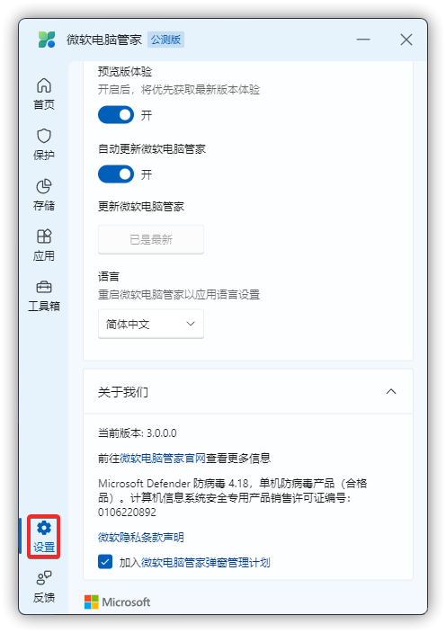

# 公开最新版本号及查询方式
最新版本号以社区版本为准，从 1.2.x 以后，版本号将统一简写，默认省略开头的 1.。

2023 年 09 月 14 日更新，版本号为 3.6.4.0。

上一个版本为：3.6.3.0，2023 年 08 月 30 日更新。（N/A 即为未知日期）

* 内部版本号将不再提供。

### 版本号查询方式
点击微软电脑管家左下方的“设置”按钮。（图例版本不一定为最新）

