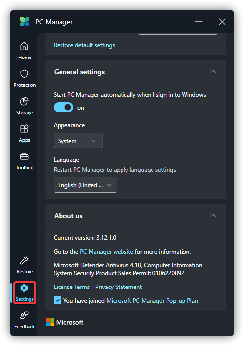

# Latest Version and Enquiry

## Latest Version
The latest version number is based on the Microsoft Store version.

Release: Updated July 1, 2024, version 3.12.1.0

Fast Preview: Updated July 13, 2024, version 3.12.3.0

When the version numbers are the same, multiple versions have the same content.

Microsoft PC Manager Beta is ending support soon, please download the latest version from [Microsoft Store](https://www.microsoft.com/store/productid/9PM860492SZD) or WinGet.
If you don't have a Microsoft Store or WinGet on your device, you can get the latest version of Microsoft PC Manager from `#attachments` on [OneDrive](https://gbcs6-my.sharepoint.com/:f:/g/personal/gucats_gbcs6_onmicrosoft_com/EoscJOQ9taJFtx9LZLPiBM0BEmVm7wsLuJOuHnwmo9EQ5w?e=QWoXaL) or Discord.

## How To Enquiry Version
Click on the Settings button at the bottom left of Microsoft PC Manager.

