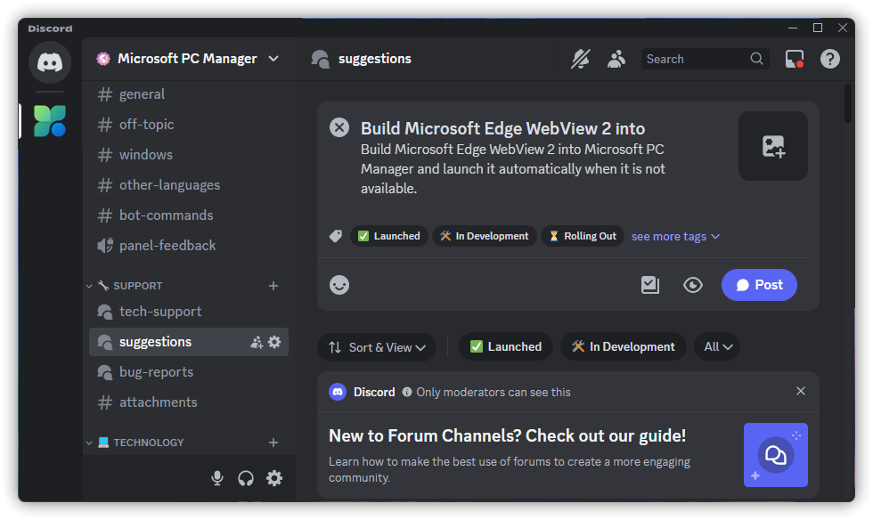

# 提交建议与反馈

## 通过 QQ 频道提交
加入 QQ 频道「微软电脑管家」并在【功能/界面建议】或【问题反馈】板块中提出您的建议，如果可以请一并叙述该功能的实现方式。

如何加入 QQ 频道

1. 点击右上角“关注我们”-“官方 QQ 频道”。

2. 使用移动端 QQ 频道搜索「微软电脑管家」。

:::warning 注意
目前，QQ 频道搜索 **仅支持移动端操作**，桌面用户请使用移动端加入，然后才能在 PCQQ 频道使用。
:::

## 通过反馈收集表提交
填写 [微软电脑管家问题与意见建议反馈表](https://docs.qq.com/form/page/DR0lRWlN2dW1GRGZ6)。

# 信息采集
信息采集指微软电脑管家开发中向用户采集的必要信息，用于软件的功能开发，不定期更新。

## 弹窗广告拦截
自微软电脑管家 v1.2.9.0 开始，你只需要加入《微软电脑管家弹窗管理计划》并使用“截图拦截”功能即可向我们提供反馈。在“设置”中勾选「加入《微软电脑管家弹窗管理计划》」即可。

或者通过以下方法手动提交反馈

从 OneDrive 中获取 [Spy++](https://ys8rx-my.sharepoint.com/:f:/g/personal/gucats_ys8rx_onmicrosoft_com/EsfXKZanAY5AkVfITGxnWd4BXzTy6TJ6iK4BTp8FbAKI0g?e=pcGfby)。（或[从 Visual Studio](https://learn.microsoft.com/zh-cn/visualstudio/debugger/how-to-start-spy-increment?view=vs-2022) 中打开）

1. 将压缩包内所有文件解压至空白文件夹内，并直接运行“spyxx_amd64.exe”（若您没有安装 VC++ 运行库请先运行“VC_redist.x64.exe”再打开“spyxx_amd64.exe”）

2. 在第二个功能区选择第五个按钮 [Find Window (Ctrl+F)]。
（若是从 Visual Studio 打开，则以下页面的语言会根据系统语言而定）

3. 在新窗口找到“Finder Tool:”旁的圆形框（红色矩形框中的内容），将其拖动到广告窗口上，并将其中的“Handle”、“Caption”、“Class”、“Style”与“Rect”复制（草绿色矩形框中的内容）

4. 选取两种方式向我们反馈：
        - a. 粘贴到 [微软电脑管家弹窗拦截定位收集表](https://docs.qq.com/sheet/DRVFPZXJoY0h4WXBU) 中。
        （*本文档没有正确与否， 只是为了方便了解小伙伴们对弹窗的认知，云文档有历史版本，本文档只可更改本人提交内容，请小伙伴自觉遵守。 ）
        - b. 加入 QQ 频道「微软电脑管家」并在【广告弹窗收集】板块中按照《广告弹窗收集表》中所提供的格式发帖。

