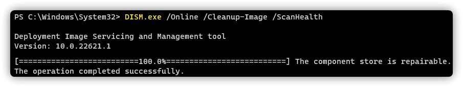
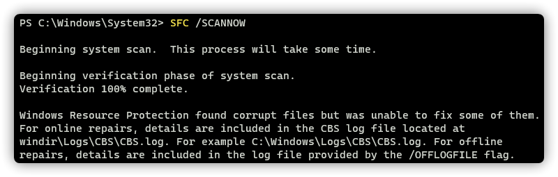
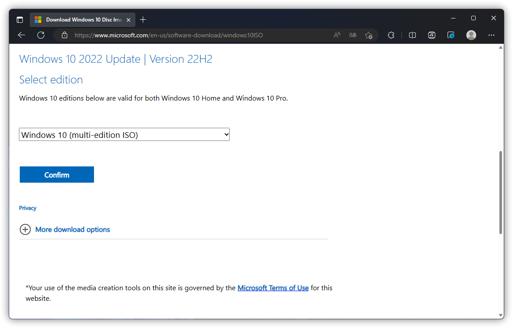
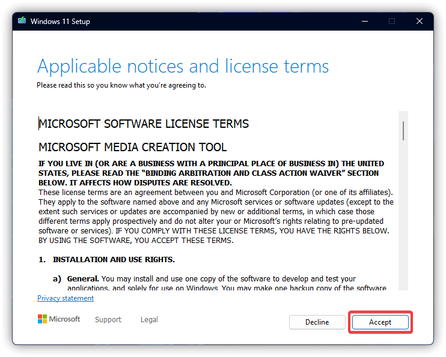
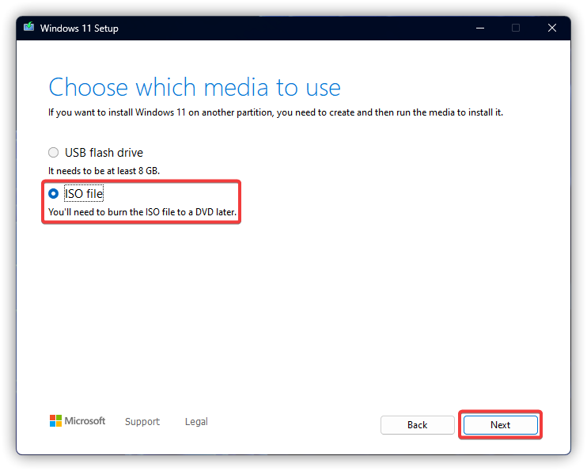
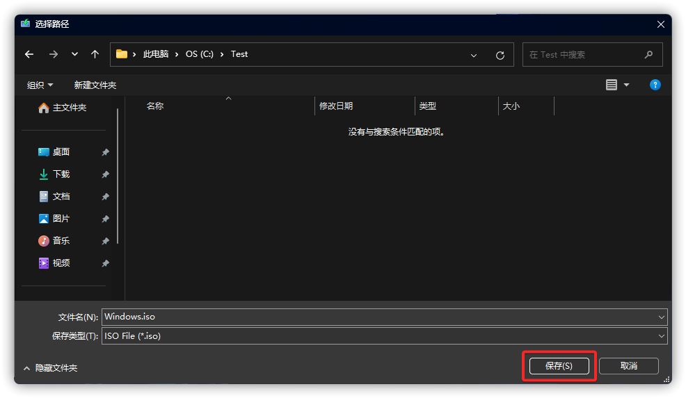
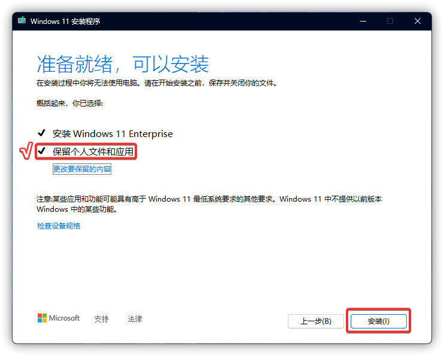
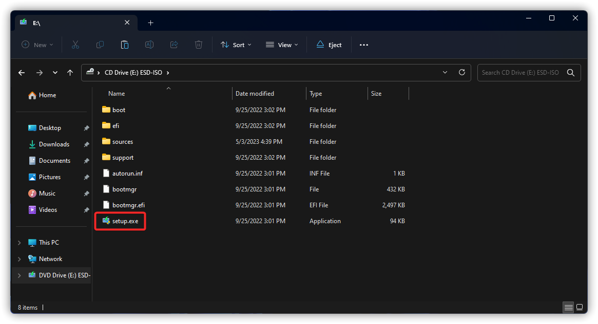

# Repairing a Windows Image with DISM & SFC
**Notice: This feature does not repair 100% of damaged images, see [How to Repair Windows Using Images](#image-repair) if necessary.**

Press WIN + X and select "Windows PowerShell (Admin)" or "Terminal (Admin)".

## To check if an image is repairable
Scan the image to check for corruption. This operation will take several minutes.

```PowerShell
DISM.exe /Online /Cleanup-Image /ScanHealth
```



Check the image to see whether any corruption has been detected.

```PowerShell
DISM.exe /Online /Cleanup-Image /CheckHealth
```


<details>

<summary>About Image Check</summary>
When you use the /CheckHealth sfc argument, the DISM tool will report whether the image is healthy, repairable, or non-repairable.

If the image is non-repairable, After trying to use the [Media Creation Tool Fixes and Upgrades](#media-creation-tool-fixes-and-upgrades). Upon failure, a **reinstallation** should be performed using a system image provided by Microsoft.

If the image is repairable, you can use the /RestoreHealth argument to repair the image. (Using some of your own sources is not covered here, see [Microsoft Learn](https://learn.microsoft.com/troubleshoot/windows-server/deployment/fix-windows-update-errors) for more information.)

</details>

To repair an image, this operation will take several minutes.

```PowerShell
DISM.exe /Online /Cleanup-Image /RestoreHealth
```


Scanning and repairing system files with SFC, this operation will take several minutes.

```PowerShell
SFC /SCANNOW
```



After you finish and restart your computer, some of the problems caused by corrupted system files will be fixed. If necessary, you can perform the Windows Update again.

## Other Errors
As you can see in the picture below, if you encountered a prompt while performing the operation, and you cannot solve the problem by yourself, you need to refer to [How to Repair Windows Using Images](#image-repair) to repair your system.


# Repairing Windows Using Images
[Windows 10](https://www.microsoft.com/software-download/windows10ISO) | [Windows 11](https://www.microsoft.com/software-download/windows11) | [Windows Insider](https://www.microsoft.com/en-us/software-download/windowsinsiderpreviewiso)

<details>

<summary>About Windows 10 ISO Download</summary>

:::warning Notice
Windows 10 no longer offers a separate ISO download on the PC web page, so if you need it, press F12 on the download page, then Ctrl + Shift + M, then F5 to refresh the page, and finally F12 to see the ISO download.
:::



</details>

Either one of the following ways is fine.

## Media Creation Tool Fixes and Upgrades
Download Media Creation Tool: [Windows 10](https://go.microsoft.com/fwlink/?LinkId=691209) | [Windows 11](https://go.microsoft.com/fwlink/?linkid=2156295)

:::warning Notice
Media Creation Tool for Windows 11 only creates ISO, while Windows 10 can upgrade / repair the system directly using Media Creation Tool.
:::

1. 

2. 

<details>

<summary>For Windows 11 the following options will be available</summary>

------

- a. 

- b. 

- c. 

See [Image Repair](#image-repair) when you're done.

------

</details>

3. 

4. 

## Image Repair
Double-click on the .ISO image file to have File Explorer automatically mount the virtual image, and then use the Setup application in the root directory of the image to repair the system.(Upgrade, time required ≥30min)

1. 

2. 

3. 

4. 

5. 