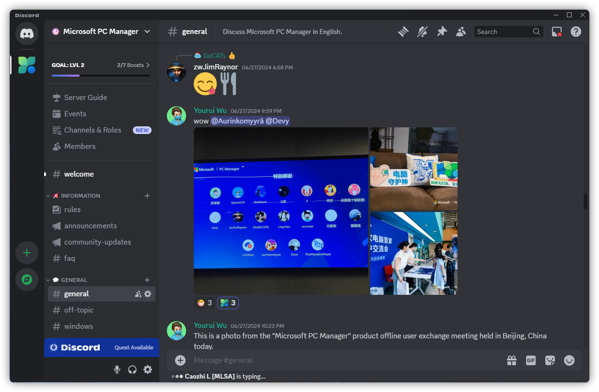

# 官方社交媒体账号

:::warning 注意
除以下提到的社交媒体账号之外，我们并未在其他社交媒体上（如哔哩哔哩、抖音等）开通官方账号，请各位小伙伴注意甄别真假！
:::

## 中国大陆社交媒体账号

### 微博
<https://weibo.com/u/7763750711>

### 小红书
<https://www.xiaohongshu.com/user/profile/5f2669c8000000000100a589>

### 微信
微信公众号：微软电脑管家

~~微信群：已失效~~

### QQ
QQ 群：[群列表（请不要重复加群）](https://forms.office.com/pages/responsepage.aspx?id=v4j5cvGGr0GRqy180BHbR7Jc7yMooGtIh8-T51_PVotUNkZSWVJSQVo4SFZVUUtDSDVHRjA4MTFMWi4u)

QQ 频道：[邀请链接](https://qun.qq.com/qqweb/qunpro/share?_wv=3&_wwv=128&appChannel=share&inviteCode=2bVm80&from=246610&biz=ka#/pc)

## 海外社交媒体账号

### Discord
<https://discord.com/invite/FTDTddsPgd>

### Reddit
<https://www.reddit.com/r/MicrosoftPcManager>

### Facebook (Traditional Chinese)
<https://www.facebook.com/microsoft.pcmanager.tw>

### WhatsApp
<https://chat.whatsapp.com/F1TS77Lqbd1JXakJn7JaQW>