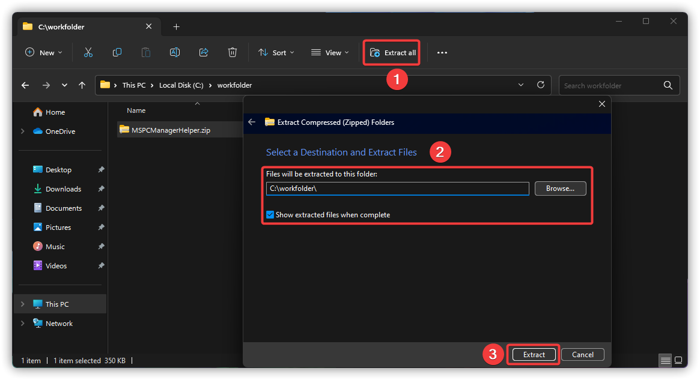
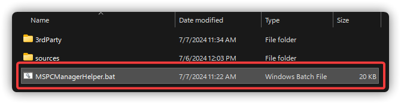
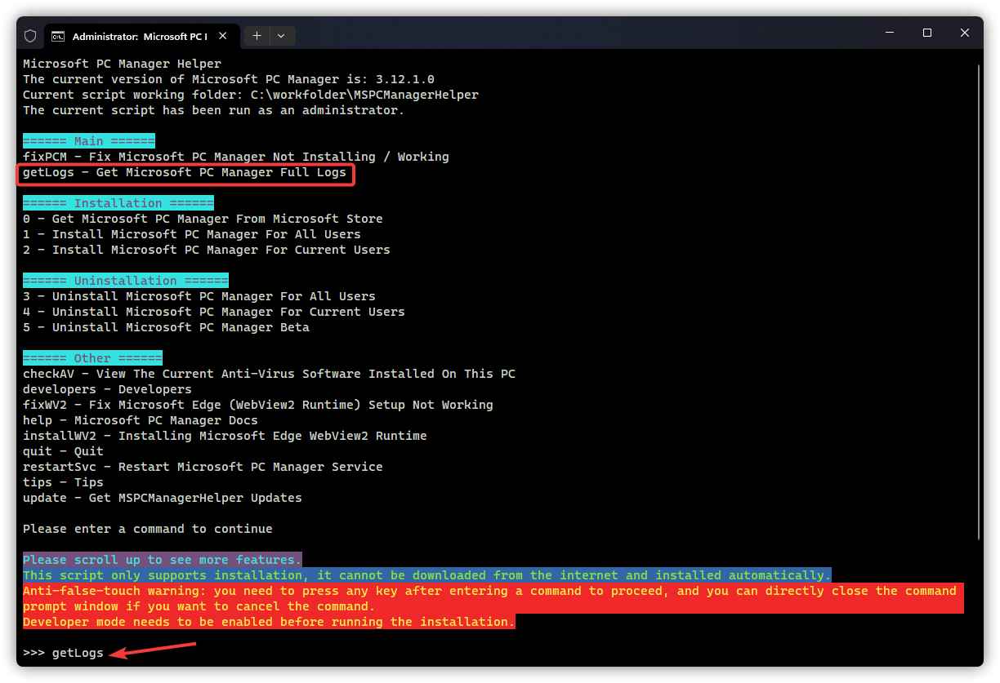
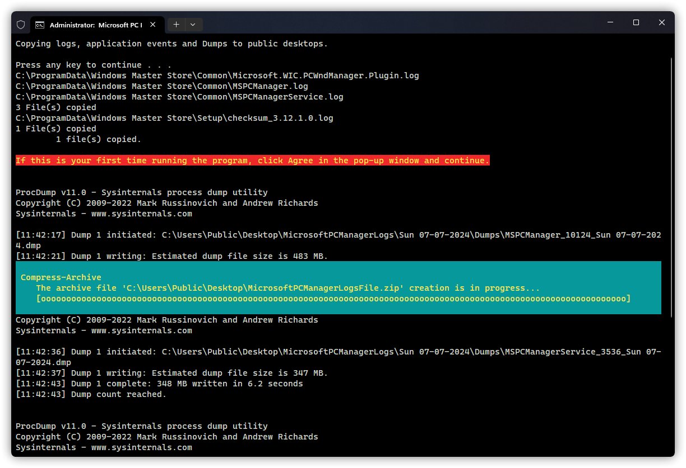
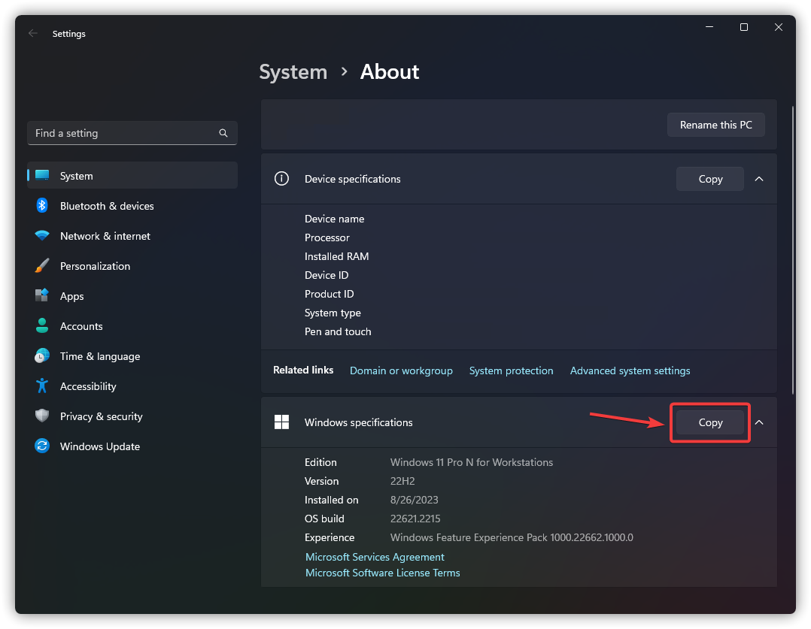
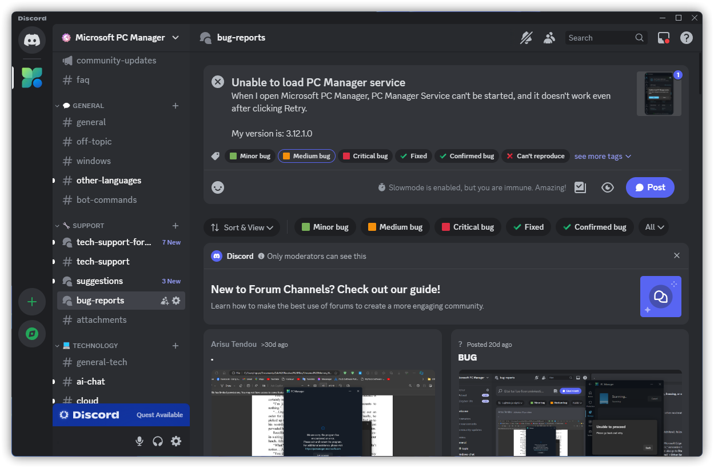
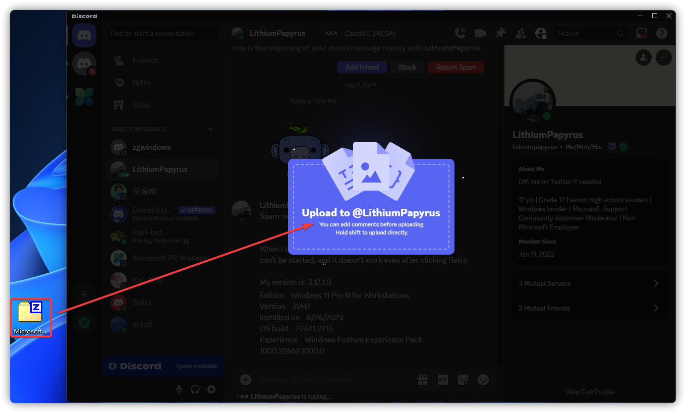

# How To Submit Logs

Get `MSPCManagerHelper_en-us.zip` from `#attachments`, moderator or [OneDrive](https://gbcs6-my.sharepoint.com/:f:/g/personal/gucats_gbcs6_onmicrosoft_com/EtKwa-2la71HmG2RxkB5lngBvvRt9CFOYsyJG_HOwYIzNA).

Select Extracl All, and extract to the current folder directory (no need to create a new folder).

When finished, open the MSPCManagerHelper folder, double-click MSPCManagerHelper.bat to open it.

When it opens, follow the prompts, type `getLogs` and press Enter (case insensitive).

After pressing any key to continue, the script will automatically fetch the logs, application events and Microsoft PC Manager Dump file(s).

In the open Windows Settings, click the Copy button next to Windows Specifications.

Finally, submit your issue to `#bug-reports` in Discord with the problem you're having, the version of Microsoft PC Manager, and how to implement it.
When you are contacted by a moderator, send the obtained Windows specifications with `MicrosoftPCManagerLogsFile.zip`

Alternatively, you can send your question, Microsoft PC Manager version, Windows specification along with `MicrosoftPCManagerLogsFile.zip` directly to the moderator who is online right now.

:::warning WARNING
Please DO NOT send the `MicrosoftPCManagerLogsFile.zip`, the `MicrosoftPCManagerLogs` folder, or any of the files in it that you have obtained to any person that you are not familiar with.
:::

