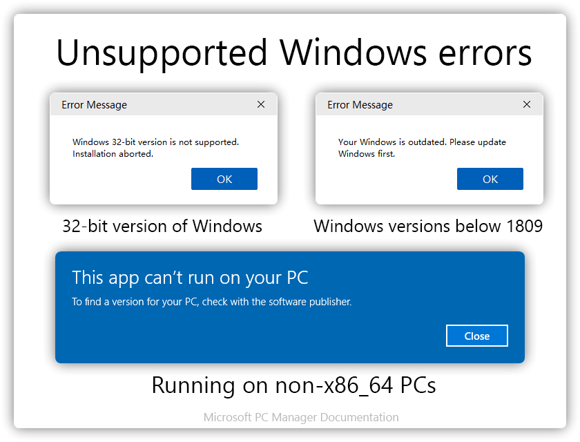

# 关于软件

## 这是微软的软件吗
微软电脑管家由 **微软(中国)有限公司** 开发、出品，由 **微软移动联新互联网服务有限公司** 运营。

自 1.2.4.0 起，微软电脑管家正式向非中国大陆地区发行，中国大陆用户请到中文官网下载微软电脑管家以体验新功能。

同时，您可以从以下方式来认证该软件是否属于 Microsoft。 
1. [Microsoft Community](https://answers.microsoft.com/zh-hans/windows/forum/all/%E5%BE%AE%E8%BD%AF%E7%94%B5%E8%84%91%E7%AE%A1/4a460771-247c-4c3d-865b-5dfa401808ff) 中由审阅人回答，并被标记为“答案”的答复；亦或者是[介绍微软电脑管家的帖子](https://answers.microsoft.com/zh-hans/windows/forum/all/%E5%BE%AE%E8%BD%AF%E7%94%B5%E8%84%91%E7%AE%A1/489a6cca-17cb-47df-95da-5d31bd95a06b)。

2. MSPCManager.exe 与软件安装包的数字签名。

3. 查看微信公众号“微软电脑管家”认证信息以辅助您确认管家的身份。

## 官网
请在 **官网或可信渠道下载** 微软电脑管家，以免遇到捆绑、广告弹窗等影响实际使用体验。

微软电脑管家官网：https://pcmanager.microsoft.com

微软电脑管家英文站点：https://pcmanager.microsoft.com/en-us

社群渠道专属下载链接：https://aka.ms/PCManagerOFL30101

从 WinGet 获取：
```PowerShell
winget install MSPCManager
````

特别提示：[用于早期测试的站点](https://windowsmaster-test.chinacloudsites.cn)、[旧官网](https://cn.bing.com/guanjia)与下载服务仅托管于 Microsoft 的合作伙伴世纪互联，但不代表微软电脑管家由世纪互联或其它第三方直接或间接地开发。

## 支持的 Windows 版本
微软电脑管家的运行依赖于部分新版本系统组件，目前仅兼容 x86_64 的 Windows 11、Windows Server 2019 及以上、Windows 10 1809 及以上操作系统，不支持更低的操作系统版本和非 x86_64 的 CPU/系统，否则可能会提示以下内容。


## 为什么微软电脑管家会自动出现在我的计算机上且无法卸载
微软电脑管家可能被其它软件，在您没有开启用户账户控制（UAC）或执行操作的软件已经拥有管理员权限/挂钩驱动时执捆绑静默安装，请检查您在出现此问题前 72h 内安装的软件是否有问题，或您的计算机是否感染病毒。
