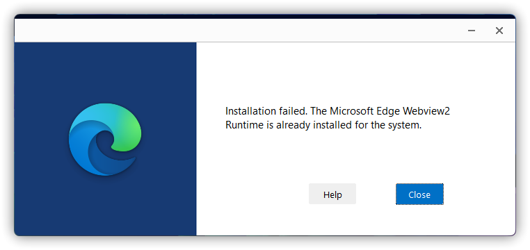

# Microsoft Edge WebView2 Issues

## Microsoft Edge (WebView2 Runtime) Setup Not Working
Causation: Redirection of setup errors caused by Image File Execution Options errors.

Solution:

1. Download `MicrosoftEdgeSetupUnlocker.reg` from [OneDrive](https://gbcs6-my.sharepoint.com/:u:/g/personal/gucats_gbcs6_onmicrosoft_com/ESvGdSUKfTtIrKfkEmlC3AABkDVyQwf3nWYcbc5tC1NiUg?e=rkTobg) and merge it to the registry. Or create a txt document, type in the following, save it and change the extension to `.reg` before merging.

```
Windows Registry Editor Version 5.00

[-HKEY_LOCAL_MACHINE\SOFTWARE\Microsoft\Windows NT\CurrentVersion\Image File Execution Options\MicrosoftEdgeUpdate.exe]

[HKEY_LOCAL_MACHINE\SOFTWARE\Microsoft\Windows NT\CurrentVersion\Image File Execution Options\MicrosoftEdgeUpdate.exe]
"DisableExceptionChainValidation"=dword:00000000
```

2. Restart your PC and try to re-run the Microsoft Edge WebView 2 Runtime setup.

## The Microsoft Edge Webview2 Runtime Is Slready Installed For The System
Figure Legend:



Solution: Right-click on the Microsoft Edge WebView2 Runtime setup and select `Run as administrator`.