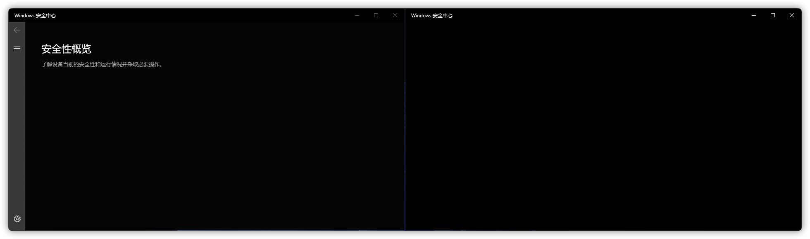
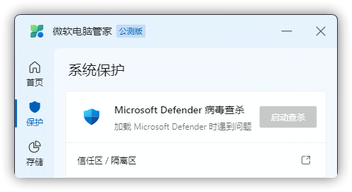
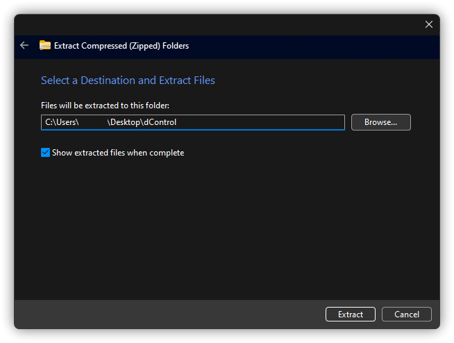
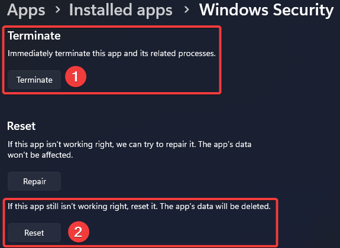
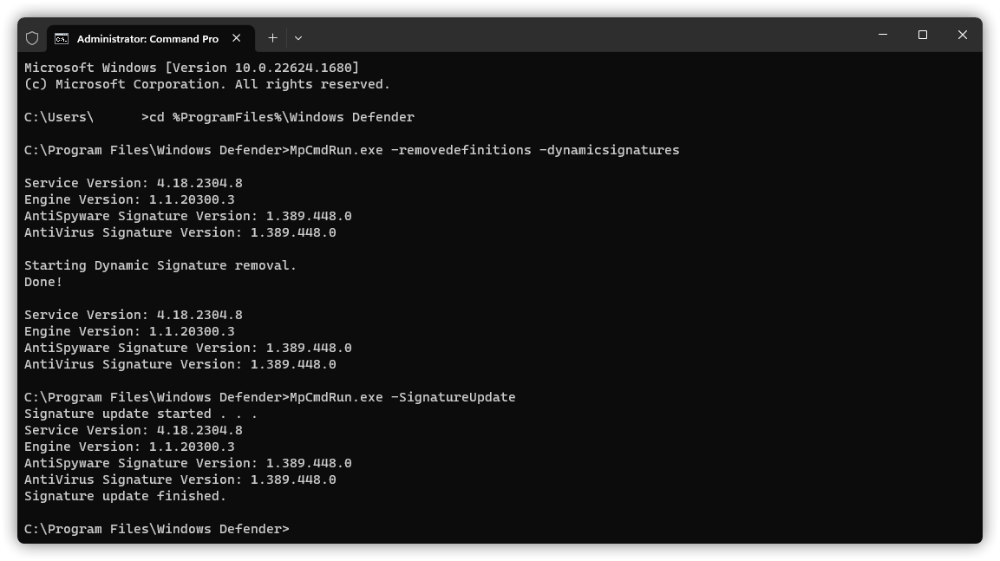

# Microsoft Defender Issue
<font size=1>Microsoft Defender antivirus, earlier known as Windows Defender (Antivirus), Windows Security Center, Microsoft AntiSpyware, and others.</font>

## Windows Security Center has no contents
Figure Legend:



Causation: blocked by the registry, or the Microsoft Defender AntiVirus component has been removed.

Solution: First try downloading from [OneDrive](https://gbcs6-my.sharepoint.com/:u:/g/personal/gucats_gbcs6_onmicrosoft_com/ES5ZszNQoXtOiueo9CpywpEB4rn3BmazwAUR41snZLcEaw?e=xvUewk) Download `EnableMicrosoftDefender.reg`, open it and select `Merge`. If the question becomes [You're using other antivirus providers.](#you-re-using-other-antivirus-providers) section, see the [Failed to load Microsoft Defender](#failed-to-load-microsoft-defender) section.

**Notice: If your current PC is using Windows that does not come with Microsoft Defender Antivirus, such as EnterpriseG, you will not be able to use any of the methods in this article to repair and use this feature.**

## Microsoft Defender not installed
Figure Legend:


Causation & Solution: See the section [Failed to load Microsoft Defender](#failed-to-load-microsoft-defender).

## No-Anti-Virus Available
Figure Legend:


Causation & Solution: See the section [Failed to load Microsoft Defender](#failed-to-load-microsoft-defender).

## Failed to load Microsoft Defender
Figure Legend:



Causation: The normal operation of Microsoft PC Manager requires Microsoft Defender Antivirus and its components, your system is missing this key component.

**Notice: If your current PC is using Windows that does not come with Microsoft Defender Antivirus, such as EnterpriseG, you will not be able to use any of the methods in this article to repair and use this feature.**

Solution: (If there is no `Windows Security` in the `Start Menu`, or if it does not work or crash, please see 2.)

1. Search for "anti-spyware name + how to enable Defender protection".

Notice: Microsoft Defender AntiVirus may also be disabled by other non-anti-virus programs.

2. See [How to Repair Windows Using Images](#image-repair).

## You're using other antivirus providers.
Figure Legend:


Description: No Anti-Virus provider other than Microsoft PC Manager is installed and real-time protection cannot be turned on.

Solution:

1. Download [dControl](https://www.sordum.org/files/downloads.php?st-defender-control) from here.

:::warning Notice
s
:::

2. After the download is complete, open the zip zrchive, open the `dControl.zip` inside and unzip it to any folder. (password: sordum)



Then run the `dControl.exe`


3. Turn off `Tampering Protection` in `Virus & threat protection` - `Manage settings` of `Virus and threat protection`.


4. Select `Disable Windows Defender` in the dControl.


5. Select `Disable Windows Defender` in the dControl.


6. Finally, select `Open Security Center` and turn on `Tamper Protection`.


If unsuccessful please repeat steps 4 - 5 before turning on Real-time protection yourself.

7. Press WIN + R，type [ms-settings:systemcomponents](ms-settings:systemcomponents) and Enter. (If it does not take effect, type [ms-settings:appsfeatures](ms-settings:appsfeatures))

8. Find the program called `Windows Security` and click `...` next to it. and click on `Advanced options`.


9. Click `Terminate`, then `Reset`, and finally restart your PC.



The following manual trigger [Microsoft Defender AntiVirus Update](https://go.microsoft.com/fwlink/?LinkID=121721&arch=x64), is optional.

10. Press WIN + Q to open search and type `cmd`, right click and select "Run as administrator".


11. Type the following command in cmd and Enter.

```CMD
cd %ProgramFiles%/Windows Defender
MpCmdRun.exe -removedefinitions -dynamicsignatures
MpCmdRun.exe -SignatureUpdate
```



If there are errors in the red rectangle, please upload the log file in the path given in the grass green rectangle to [Microsoft Community](https://answers.microsoft.com/en-us/newthread) for assistance.


and select the following in Topics: (The Version depends on your current Windows version)


