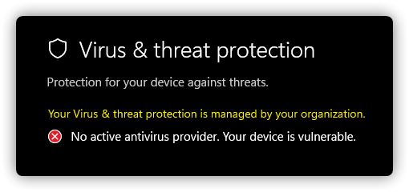
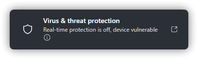
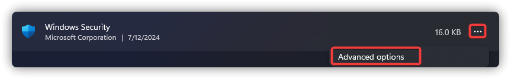
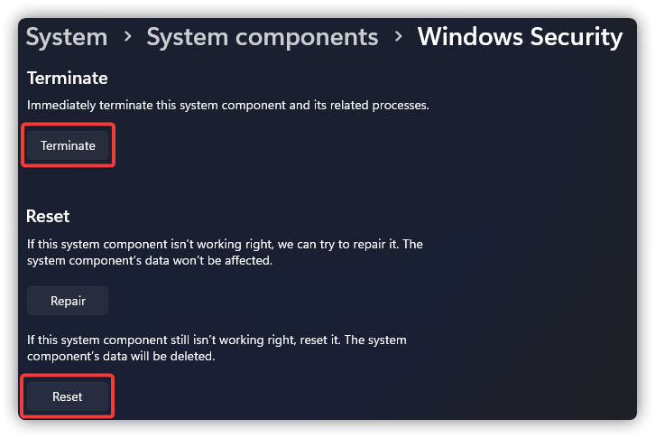
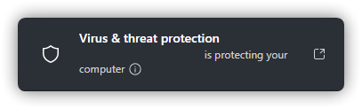
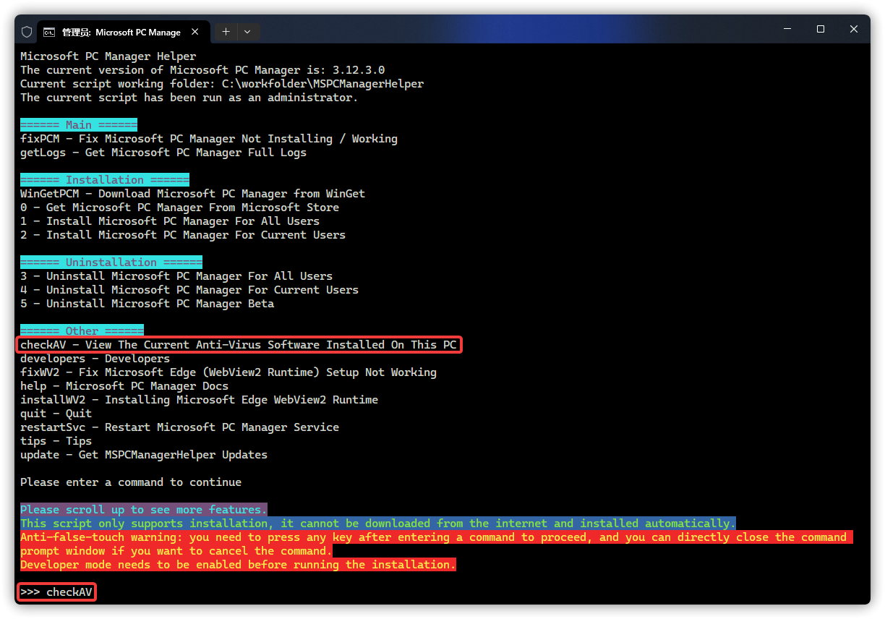
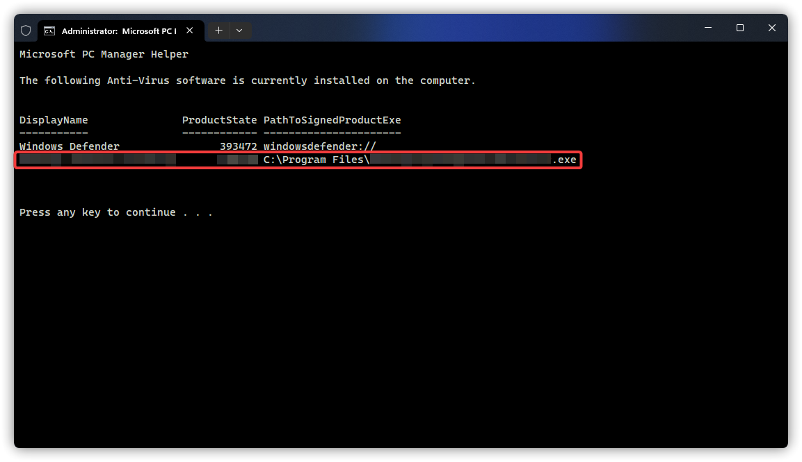

# Microsoft Defender Antivirus Issue
<font size=1>Microsoft Defender antivirus, earlier known as Windows Defender (Antivirus), Windows Security Center, Microsoft AntiSpyware, and others.</font>

## Windows Security Center has no contents
Figure Legend:


Causation: blocked by the registry, or the Microsoft Defender AntiVirus component has been removed.

Solution: First try downloading from [OneDrive](https://gbcs6-my.sharepoint.com/:u:/g/personal/gucats_gbcs6_onmicrosoft_com/ES5ZszNQoXtOiueo9CpywpEB4rn3BmazwAUR41snZLcEaw?e=xvUewk) Download `EnableMicrosoftDefender.reg`, open it and select `Merge`. If the question becomes [No Active Antivirus Provider](#no-active-antivirus-provider) section, see the [You're Using Other Antivirus Providers](#you-re-using-other-antivirus-providers) section.

**Notice: If your current PC is using Windows that does not come with Microsoft Defender Antivirus, such as EnterpriseG, you will not be able to use any of the methods in this article to repair and use this feature.**

## No Active Antivirus Provider
Figure Legend:



Causation & Solution: See the section [Real-time Protection Is Off](#real-time-protection-is-off).

## Unable To Use Windows Security
Figure Legend:


Causation & Solution: See the section [Real-time Protection Is Off](#real-time-protection-is-off).

## Real-time Protection Is Off
Figure Legend:



Causation: The normal operation of Microsoft PC Manager requires Microsoft Defender Antivirus and its components, your system is missing this key component.

**Notice: If your current PC is using Windows that does not come with Microsoft Defender Antivirus, such as EnterpriseG, you will not be able to use any of the methods in this article to repair and use this feature.**

Solution: (If there is no `Windows Security` in the `Start Menu`, or if it does not work or crash, please see 2., If it still doesn't work, see 3.)

1. Search for "anti-virus name + how to enable Defender protection".

Notice: Microsoft Defender AntiVirus may also be disabled by other non-anti-virus programs.

2. See [You're using other antivirus providers](#you-re-using-other-antivirus-providers).

3. See [How to Repair Windows Using Images](#image-repair).

## You're Using Other Antivirus Providers
Figure Legend:


Description: No Anti-Virus provider other than Microsoft PC Manager is installed and real-time protection cannot be turned on.

Solution:

1. Download [dControl](https://www.sordum.org/files/downloads.php?st-defender-control) from here.

:::warning Notice
This is a non-official Microsoft website. This site appears to provide detailed information on pace and safety. The site may advertise products you don't need, so please study the details on the site thoroughly before deciding to download and install it.
:::

2. After the download is complete, open the zip zrchive, open the `dControl.zip` inside and unzip it to any folder. (password: sordum)


Then run the `dControl.exe`


3. Turn off `Tampering Protection` in `Virus & threat protection` - `Manage settings` of `Virus and threat protection`.


4. Select `Disable Windows Defender` in the dControl.


5. Select `Disable Windows Defender` in the dControl.


6. Finally, select `Open Security Center` and turn on `Tamper Protection`.


If unsuccessful please repeat steps 4 - 5 before turning on Real-time protection yourself.

7. Press WIN + R, type [ms-settings:systemcomponents](ms-settings:systemcomponents) and Enter. (If it does not take effect, type [ms-settings:appsfeatures](ms-settings:appsfeatures))

8. Find the program called `Windows Security` and click `...` next to it. and click on `Advanced options`.



9. Click `Terminate`, then `Reset`, and finally restart your PC.



The following manual trigger [Microsoft Defender AntiVirus Update](https://go.microsoft.com/fwlink/?LinkID=121721&arch=x64), is optional.

10. Press WIN + Q to open search and type `cmd`, right click and select "Run as administrator".


11. Type the following command in cmd and Enter.

```CMD
cd %ProgramFiles%/Windows Defender
MpCmdRun.exe -removedefinitions -dynamicsignatures
MpCmdRun.exe -SignatureUpdate
```


If there are errors in the red rectangle, please upload the log file in the path given in the grass green rectangle to [Microsoft Community](https://answers.microsoft.com/en-us/newthread) for assistance.


and select the following in Topics: (The Version depends on your current Windows version)


## Antivirus software is protecting your computer
Figure Legend:



Description: No antivirus provider other than Microsoft PC Manager is installed, or other antivirus provider(s) have been installed and uninstalled intentionally or unintentionally.

Causation: Errors caused by incomplete uninstallation of other antivirus providers.

Solution:

1. Download `Microsoft PC Manager Helper Script_CMD` from [OneDrive](https://gbcs6-my.sharepoint.com/:f:/g/personal/gucats_gbcs6_onmicrosoft_com/EtKwa-2la71HmG2RxkB5lngBvvRt9CFOYsyJG_HOwYIzNA?e=iDgaEm), unzip all its contents and run the `MSPCManagerHelper.bat` inside it by typing `checkAV` and enter.



2. Wait a moment and the script will list the name, status and path to the executable file of the anti-virus software installed on your PC. (Windows Defender is Microsoft Defender Antivirus)



3. Solve the problem on your own or seek help from a moderator according to the path given.