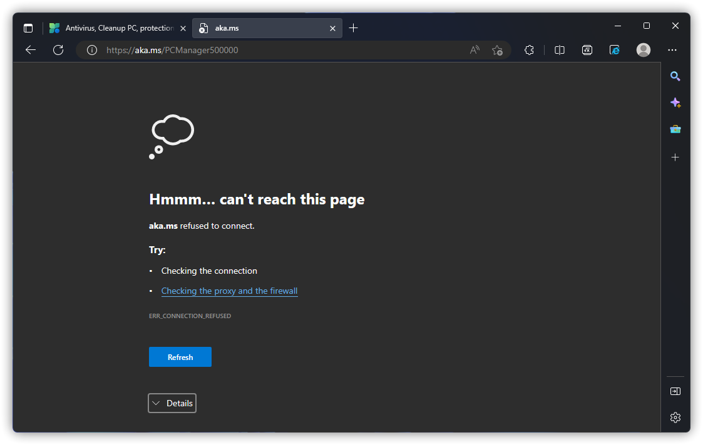
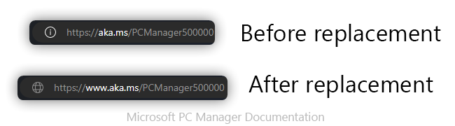

# 安装前的问题

## 无法更改安装目录
问题图例：V1.x 与 V2.x 对比。

原因：微软电脑管家的关键组件需要在 C 盘下才能保证其正常运行。

## 官网正常打开但无法下载
问题图例：（亦或者提示“aka.ms 花了太长时间进行响应”）

解决方案：

1. 将地址栏中“aka.ms”字样的内容替换为“www.aka.ms”（如下图高亮部分所示）

2. 将 DNS 更换为 223.5.5.5 等其它可靠 IPv4 DNS 后再重试。（需要帮助？请参阅[《如何更改 DNS》](../appendix/change-DNS)）