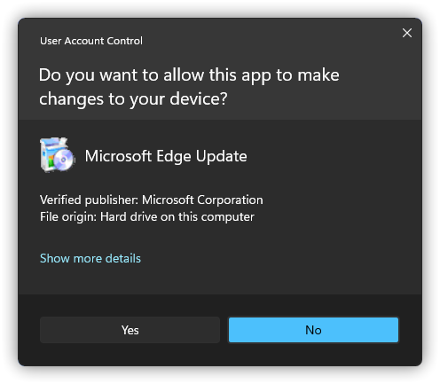
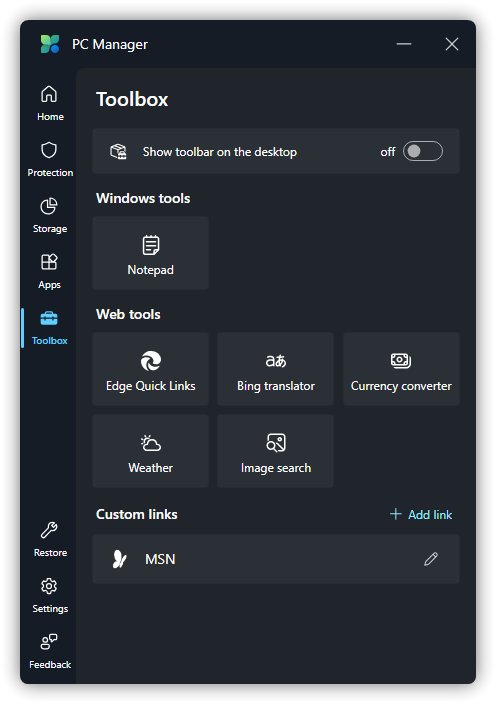

# Main Program Usage Issues

## Sorry, PC Manager Is Missing The Required Runtime
Figure Legend:


Causation & Solution: See the section [Error During System Repair](#error-during-system-repair).

## "Repairing..." For a Long Time
Figure Legend:


Causation & Solution: See the section [Error During System Repair](#error-during-system-repair).

## Error During System Repair
Figure Legend:


Causation:

1. Microsoft Edge WebView2 is not installed.

2. Microsoft Edge Webview2 installation UAC pop-up does not click `Yes`.

3. Microsoft Edge WebView2 and / or Microsoft Edge version is too old.3

4. you have a poor network environment or the Microsoft PC Manager is not networkable, resulting in poor communication with Microsoft.

5. <font color=red>Microsoft Edge (WebView 2 Runtime) installer errors caused by the registry.</font>

6. Other reasons.

Solution: (Please first **exit Microsoft PC Manager**)

1. Please try [Download Microsoft Edge WebView2](https://go.microsoft.com/fwlink/?linkid=2124701) and install it. (You need to right-click the installer and select `Run as administrator`)

2. Please try to repair it again and just click `Yes`.



3. Please try the following steps to fix Microsoft Edge WebView2 Runtime:

a. Press WIN + R, type [ms-settings:appsfeatures](ms-settings:appsfeatures) and enter.

b. Find the program called `Microsoft Edge WebView2 Runtime` in the list and click `...` next to it. and click `Modify`.


c. After clicking `Modify`, the installer will show the following window. After clicking `Repair`, the installer will automatically network to download and reinstall Microsoft Edge WebView2.


d. Start Microsoft PC Manager

4. You need to determine if you have Microsoft Edge WebView2 installed first, the steps are as follows:

a. Press WIN + R, type [ms-settings:appsfeatures](ms-settings:appsfeatures) and enter.

b. Find the program called `Microsoft Edge WebView2 Runtime` in the list.


c. If already installed, repeat step 3. If not installed, repeat step 1.

5. See [How To Change DNS](../appendix/change-DNS#how-to-change-dns)

6. See the section [Microsoft Edge (WebView2 Runtime) Setup Not Working](../problem-solving/EdgeWebView2#microsoft-edge-webview2-runtime-setup-not-working).

If the error persists, see [How To Submit Logs](../appendix/submit-logs), then go to [How to Repair Windows Using Images](../appendix/repair-system-image#image-repair).

## Something Happened On Our End
Figure Legend:


Causation & Solution: See the section [Download Failure](#download-failure).

## Download Failure
Figure Legend:


Causation:

1. The Microsoft PC Manager latest version conflicts with the Microsoft PC Manager Beta.

2. you have a poor network environment or the Microsoft PC Manager is not networkable, resulting in poor communication with Microsoft.

Solution:

1. Uninstall Microsoft PC Manager Beta and run Terminal or PowerShell as administrator and enter the following command:

```PowerShell
Get-AppxPackage -AllUsers | where-object {$_.name -like "Microsoft.MicrosoftPCManager"} | Remove-AppxPackage -AllUsers
```

2. See [How To Change DNS](../appendix/change-DNS#how-to-change-dns)

:::warning WARING
Microsoft PC Manager Beta is ending support soon, please download the latest version from [Microsoft Store](https://www.microsoft.com/store/productid/9PM860492SZD) or WinGet.
If you don't have a Microsoft Store or WinGet on your device, you can get the latest of Microsoft PC Manager from `#attachments` on [OneDrive](https://gbcs6-my.sharepoint.com/:f:/g/personal/gucats_gbcs6_onmicrosoft_com/EoscJOQ9taJFtx9LZLPiBM0BEmVm7wsLuJOuHnwmo9EQ5w?e=QWoXaL) or Discord.
:::

## Unable To Load PC Manager Service
Figure Legend:


Causation & Solution: See the section [Unable To Proceed](#unable-to-proceed).

## Unable To Proceed
Figure Legend:


Solution:
1. Press WIN + R, type in services.msc and enter.

2. Locate the service called `PCManager Service (Store)`, right click and select `Restart (E)`. (or `Start(S)`)


3. Try to rerun the `Deep cleanup` task.


If the error persists, see [How To Submit Logs](../appendix/submit-advice-n-feedback) and send us the logs, dump files, screenshots of the problem, and the system version you've collected, as you may be needed to assist us in fixing it. <font color=red>After finishing, uninstall Microsoft PC Manager **completely and then reinstall and retry**</font>.

## Unable To Install Microsoft PC Manager
Description: After using the Microsoft PC Manager Beta, you cannot upgrade to the latest version of Microsoft PC Manager via Microsoft Store or WinGet, and the problem persists after uninstalling it.

Solution:
1. Uninstall the Microsoft PC Manager Beta

2. Press WIN + X to open the Start Menu Advanced menu and select `Terminal (Admin)` (make sure you are running PowerShell) or `Windows PowerShell (Admin)`.


3. Enter the following command in it and restart your PC when you are done.

```PowerShell
Get-AppxPackage -AllUsers | where-object {$_.name -like "Microsoft.MicrosoftPCManager"} | Remove-AppxPackage -AllUsers
```

## Windows Tool Options Are Missing
Figure Legend:

Windows 11:


Windows 10:


Other Windows missing features:



Microsoft PC Manager Beta:


Causation: There is no corresponding in-box app(s) in the system, or the features is missing.

Solution: 

1. Upgrade your system to [Windows 11](https://aka.ms/DownloadWindows11), or install the missing in-box app(s). ([Live Captions](https://support.microsoft.com/windows/%E4%BD%BF%E7%94%A8%E5%AE%9E%E6%97%B6%E5%AD%97%E5%B9%95%E6%9B%B4%E5%A5%BD%E5%9C%B0%E4%BA%86%E8%A7%A3%E9%9F%B3%E9%A2%91-b52da59c-14b8-4031-aeeb-f6a47e6055df) is available in Windows 11 22H2 and later)

2. If you are currently using Microsoft PC Manager Beta, please download the latest version from [Microsoft Store](https://www.microsoft.com/store/productid/9PM860492SZD) or WinGet after uninstalling. If your device does not have Microsoft Store or WinGet, you can get the latest version of Microsoft PC Manager from `#attachments` on [OneDrive](https://gbcs6-my.sharepoint.com/:f:/g/personal/gucats_gbcs6_onmicrosoft_com/EoscJOQ9taJFtx9LZLPiBM0BEmVm7wsLuJOuHnwmo9EQ5w?e=QWoXaL) or Discord.

## Not Implemented
Figure Legend:


Solution: (Only one of these steps needs to be done)
1. Upgrade your PC Manager version to 3.3.14.0 or later via Microsoft Store or WinGet.

2. Turn to `Settings` > `Seneral settings` and turn off `Start PC Manager automatically when I sign in to Windows`, then restart your PC twice.


## Block Unwanted Updates
Figure Legend:


1. Download [wushowhide.diagcab](http://download.microsoft.com/download/F/2/2/F22D5FDB-59CD-4275-8C95-1BE17BF70B21/wushowhide.diagcab) from Microsoft and open it.

2. Click `Next(N)`.


Select `Hide updates`.


3. Check the updates you want to block and click `Next(N)`.


Wait for the tool to complete the troubleshooting.


4. Just close the troubleshooting tool when you're done. The blocked updates will not reappear within the app.


5. Please note that this tool also blocks the corresponding updates in Windows Update, and please do not delete files or folders in the `C:\Windows\SoftwareDistribution` directory other than the `Download` folder, as this will not work. If you need to show an update again, select `Show updates` at step 2 of the troubleshooting tool and proceed to the next step.