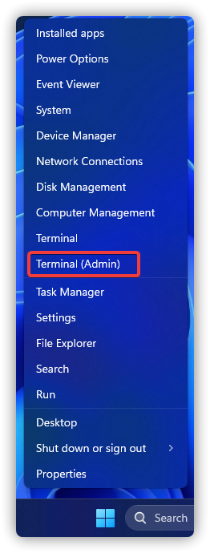
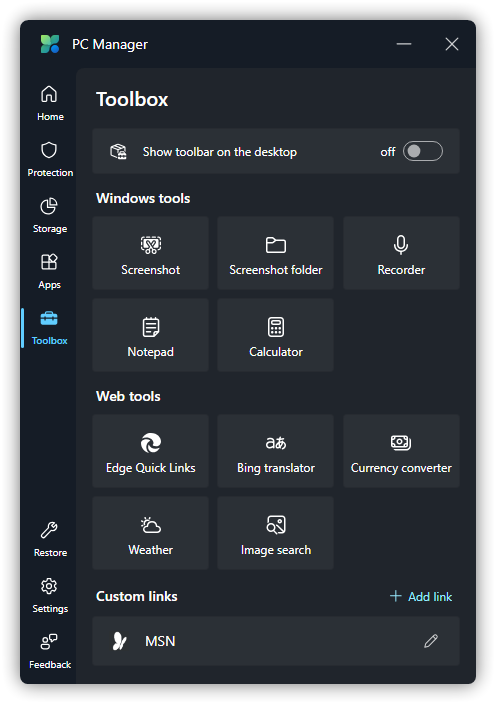

# Main Program Usage Issues

## Sorry, PC Manager Is Missing The Required Runtime
Figure Legend:


Causation & Solution: See the section [Error During System Repair](#error-during-system-repair).

## "Repairing..." For a Long Time
Figure Legend:


Causation & Solution: See the section [Error During System Repair](#error-during-system-repair).

## Error During System Repair
Figure Legend:


Causation:

1. 未安装 Microsoft Edge WebView2。

2. Microsoft Edge Webview2 安装时弹出的 UAC 弹窗未授权。

3. Microsoft Edge WebView2 和（或）Microsoft Edge 版本过旧。

4. 你的网络环境较差，或微软电脑管家主程序无法联网，导致与 Microsoft 通信不佳。

5. <font color=red>注册表引起的 Microsoft Edge (WebView 2 Runtime) 安装程序错误。</font>

6. 其它原因。

Solution:（请先 **退出微软电脑管家主程序** ）

1. 请尝试 [下载 Microsoft Edge WebView2](https://go.microsoft.com/fwlink/?linkid=2124701) 并安装。（需要右键安装程序，选择“以管理员身份运行”）

2. 请尝试重新修复，并直接点击“是”。


3. 请尝试以下步骤以修复 Microsoft Edge WebView2 Runtime。

a. 按下 WIN + R，输入 [ms-settings:appsfeatures](ms-settings:appsfeatures) 并回车。

b. 在列表中找到名为“Microsoft Edge WebView2 Runtime”的程序，并点击旁边的“...”，再点击“修改”。


c. 点击修改后，安装程序会出现以下弹窗，点击“修复”后，安装程序将自动联网下载并重新安装 Microsoft Edge WebView2。


d. 启动微软电脑管家。

4. 需要先判断自己是否有安装 Microsoft Edge WebView2，步骤如下：

a. 按下 WIN + R，输入 [ms-settings:appsfeatures](ms-settings:appsfeatures) 并回车。

b. 在列表中找到名为“Microsoft Edge WebView2 Runtime”的程序。


c.若已经安装，请重复 3. 的步骤；若未安装，请重复 1. 的步骤。

5. See the section [Microsoft Edge (WebView2 Runtime) Setup Not Working](../problem-solving/EdgeWebView2#microsoft-edge-webview2-runtime-setup-not-working).

若依旧报错，请先参阅[How To Submit Logs](../appendix/submit-logs)，再转到[How to Repair Windows Using Images](../appendix/repair-system-image#image-repair)。

## Unable To Load PC Manager Service
Figure Legend:


Causation & Solution: See the section [《无法完成当前操作》](#无法完成当前操作).

## 无法完成当前操作
Figure Legend:


Solution:
1. 按下 WIN + R，输入 services.msc 并回车

2. 找到名为“PCManager Service (Store)”的服务，右键选择“重新启动(E)”。（或者是“启动(S)”）


3. 尝试重新运行“垃圾清理”任务。


若报错依旧，请参阅[《提交日志》](../appendix/submit-advice-n-feedback)，把你收集到的日志、转储文件、问题截图以及系统版本一并发给我们，后续可能会需要你来协助我们修复。<font color=red>完成后将微软电脑管家**完全卸载后再重新安装重试**</font>。

## 微软电脑管家无法安装
问题现象：使用微软电脑管家公测版后，无法通过 Microsoft Store 或 WinGet 升级到微软电脑管家正式版，且卸载后问题依旧。

Solution:
1. 卸载微软电脑管家公测版。

2. 按下 WIN + X 打开开始菜单高级菜单，并选择“终端管理员”（请确保运行的是PowerShell）或“Windows PowerShell (管理员)”。



3. 在里面输入以下命令，完成后重启计算机。

```PowerShell
Get-AppxPackage -AllUsers | where-object {$_.name -like "Microsoft.MicrosoftPCManager"} | Remove-AppxPackage -AllUsers
```

## Windows 工具选项缺少
Figure Legend:

Windows 11：


Windows 10：



其它缺少对应功能的 Windows：


Causation: 系统内无对应系统 UWP 应用，或缺少功能。

Solution: 升级系统至 [Windows 11](https://aka.ms/DownloadWindows11)，或补全缺失的系统 WindowsApps 应用。（[实时字幕](https://support.microsoft.com/zh-cn/windows/%E4%BD%BF%E7%94%A8%E5%AE%9E%E6%97%B6%E5%AD%97%E5%B9%95%E6%9B%B4%E5%A5%BD%E5%9C%B0%E4%BA%86%E8%A7%A3%E9%9F%B3%E9%A2%91-b52da59c-14b8-4031-aeeb-f6a47e6055df) 在 Windows 11 22H2 及更高版本中提供）

## 没有注册类
Figure Legend:


Solution: (Only one of these steps needs to be done)
1. Upgrade your PC Manager version to 3.3.14.0 or later via Microsoft Store or WinGet.

2. Turn to `Settings` > `Seneral settings` and turn off "Start PC Manager automatically when I sign in to Windows", then restart your PC twice.


## 屏蔽应用内不想要的更新项
Figure Legend:


1. 从 Microsoft 下载 [wushowhide.diagcab](http://download.microsoft.com/download/F/2/2/F22D5FDB-59CD-4275-8C95-1BE17BF70B21/wushowhide.diagcab) 并打开。

2. 点击“下一步(N)”。


选择“Hide updates”。


3. 勾选你需要屏蔽的更新，并点击“下一步(N)”。


等待工具完成疑难解答。


4. 完成后关闭疑难解答工具即可。应用内不会再次出现已屏蔽的更新。


5. 请注意，此工具同时在 Windows 更新中也会屏蔽对应更新，也请不要删除 <code>C:\Windows\SoftwareDistribution</code> 目录下除 <code>Download</code> 文件夹之外的文件或文件夹，否则会失效。如果需要再次显示某个更新，请在疑难解答工具的步骤二时选择“Show updates”并执行下一步的操作。