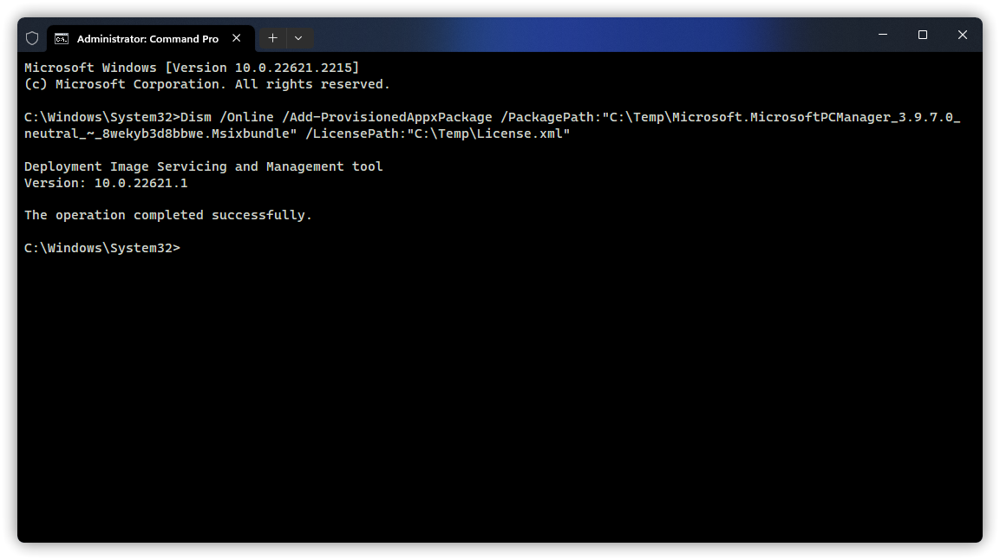

# Other Usage

## Install / Uninstall Microsoft PC Manager for all users on the computer

### Install Microsoft Computer Manager for all users on this computer
1. Run Terminal or CMD as administrator.

2. Enter the following command:

```CMD
Dism /Online /Add-ProvisionedAppxPackage /PackagePath:"<path\to\file>" /LicensePath:"<path\to\file>"
```

In the command, the `<path\to\file>` in `/PackagePath:"<path\to\file>"` and `/LicensePath:"<path\to\file>"` need to be manually changed to the path of the `.MSIX` installation package and [License.xml](https://gbcs6-my.sharepoint.com/:u:/g/personal/gucats_gbcs6_onmicrosoft_com/EeoC00Vg3qVAhtN8BnKKU8cBd1cNJ4kpoagohN0D__Fk0w).

e.g.: (If you use the `/Image` parameter, or if you can connect to the Internet after installation, you don't need the license file, change `/LicensePath:"<path\to\file>"` to `/SkipLicense`)

```CMD
Dism /Online /Add-ProvisionedAppxPackage /PackagePath:"C:\Temp\Microsoft.MicrosoftPCManager_3.9.7.0_neutral_~_8wekyb3d8bbwe.Msixbundle" /LicensePath:"C:\Temp\License.xml"
```



### Uninstall Microsoft PC Manager for all users on your computer
1. Run Terminal or PowerShell as administrator.

2. Enter the following command:

```PowerShell
Get-AppxPackage -AllUsers | where-object {$_.name -like "Microsoft.MicrosoftPCManager"} | Remove-AppxPackage -AllUsers
```