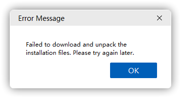
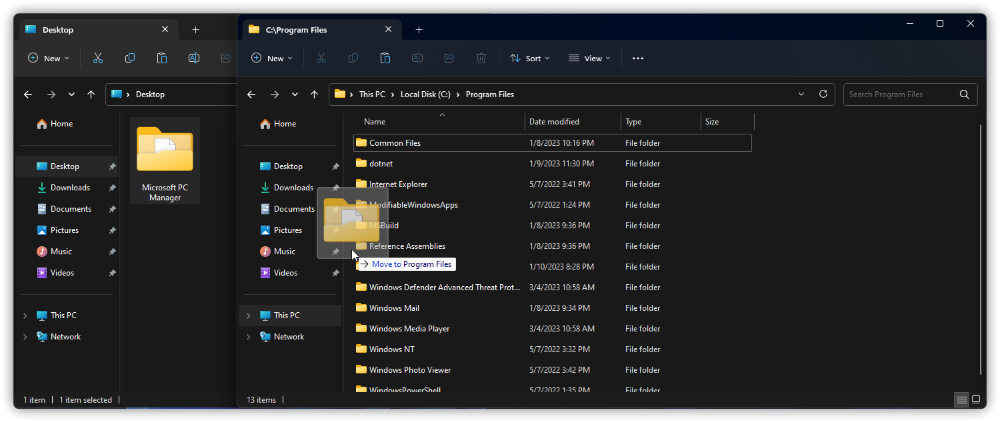
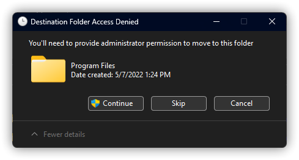
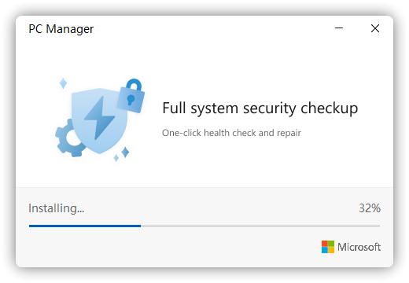

# 安装问题

## 下载展开安装文件失败

问题图例：

问题引起：

1. 您的网络环境较差，导致与 Microsoft 服务器通信不佳。（仅在线安装包）
2. %TEMP% 文件夹无法被安装程序正常访问或 PowerShell 脚本被第三方软件拦截。	（在线/离线安装包）

解决方案：
1. 请在群文件、向管理员获取离线包或 [点击这里下载](https://aka.ms/PCManagerOFL30101)。

或者将 DNS 更换为 223.5.5.5 等其它可靠 IPv4 DNS 后再重试使用在线安装包。（需要帮助？请参阅[《如何更改 DNS》](../appendix/change-DNS)）

2. 请使用免安装版，请在群文件查找、向管理员获取。（一般被命名为“PCManagerFiles_<版本号>.zip”）

<details>

<summary>你也可以通过短链接下载</summary>

```URL
https://aka.ms/WMOnlineZip10000_<版本号>
```

版本号请在[《公开最新版本号及查询方式》](../appendix/check-version)中找到全称版本号。

例如版本号为 3.0.0.2，则链接如下：

```URL
https://aka.ms/WMOnlineZip10000_3.0.0.2
```

</details>

**特别提示：在使用免安装版之前，请先参阅[《提交日志：提交安装失败的 Log》](../appendix/feedback-bugs#提交安装失败的-log)来提交你的安装日志后，再使用免安装版，以便我们及时地修复该问题。**

使用方法：
**为了确保微软电脑管家主程序及其组件的稳定性，在解压使用免安装版时，请选择解压到 C:/Program Files/Microsoft PC Manager 文件夹；否则，因为解压到其它文件夹所引起的问题将不会受到支持与帮助。**

1. 打开 `PCManagerFiles.zip` 文件，并选择全部解压到桌面的 `Microsoft PC Manager` 文件夹里


2. 打开 C:/Program Files 目录，并将“Microsoft PC Manager”文件夹复制。



3. 在弹窗中点击“继续(C)”。



4. 然后在“Microsoft PC Manager”文件夹里找到名为“MSPCManager.exe”的文件，左键选择它，然后按下 Shift+F10（如果是 Windows 10 或经典右键菜单的 Windows 11 可直接右键），在弹出的菜单栏中选择“发送到(N)”>“桌面快捷方式”。


5. 然后将桌面上的快捷方式重命名（可不做），然后双击即可运行微软电脑管家。

特别提示：使用该方法前请尝试重新下载离线包，或退出所有反病毒与间谍软件后再重试。

## 主程序安装时长时间卡在 32%
问题图例：

问题引起：您的网络环境较差，导致与 Microsoft 通信不佳。（仅在线安装包）

解决方案：下载使用[离线包](https://aka.ms/PCManagerOFL30101)；或者将 DNS 更换为 223.5.5.5 等其它可靠 IPv4 DNS 后再重试。（需要帮助？请参阅[《如何更改 DNS》](../appendix/change-DNS)）