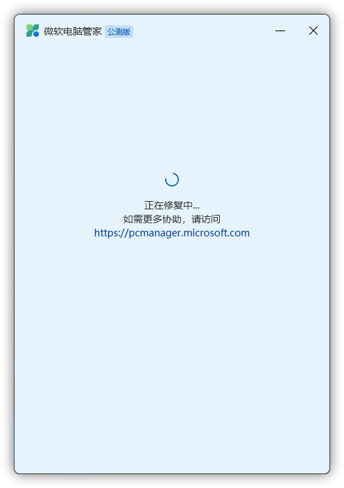
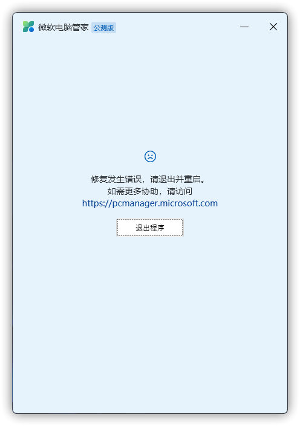
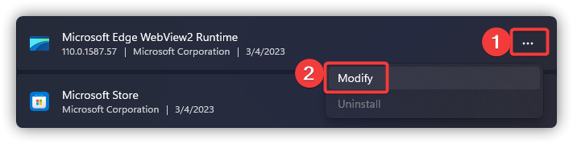
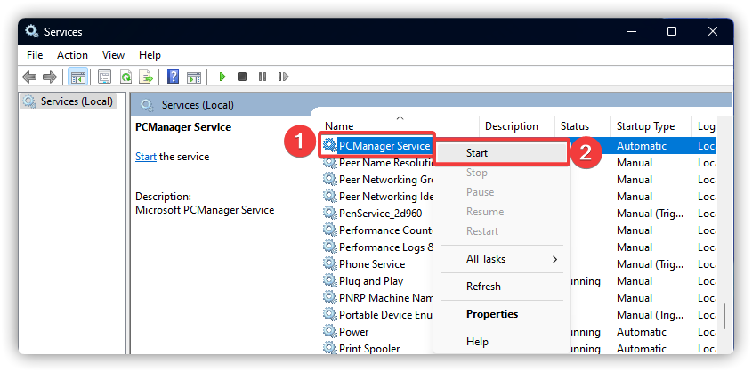
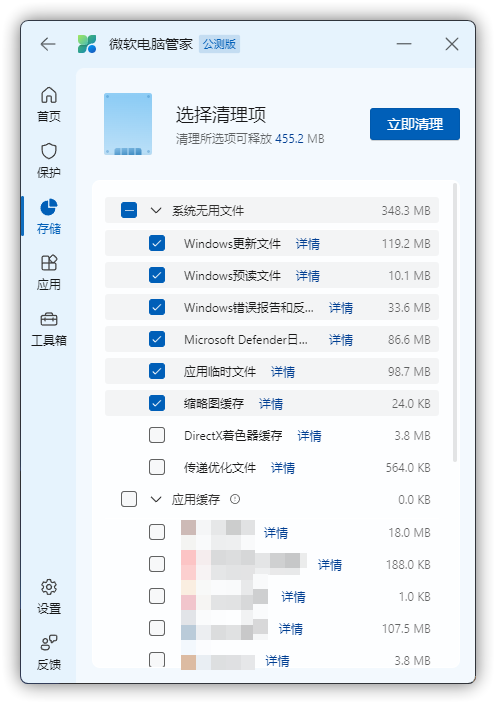
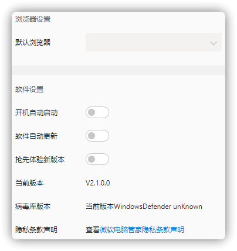

# 使用问题

## “抱歉，程序运行发生了错误，请点击‘重试’按钮进行修复。”
问题图例：

问题引起&解决方案：请参阅[《修复发生错误，请退出并重启。》](#修复发生错误-请退出并重启。)。

## 长时间处于“正在修复中...”
问题图例：

问题引起&解决方案：请参阅[《修复发生错误，请退出并重启。》](#修复发生错误-请退出并重启。)。

## "修复发生错误，请退出并重启。"
问题图例：

问题引起：

1. 未安装 Microsoft Edge WebView2。

2. Microsoft Edge Webview2 安装时弹出的 UAC 弹窗未授权。

3. Microsoft Edge WebView2 和（或）Microsoft Edge 版本过旧。

4. 您的网络环境较差，或微软电脑管家主程序无法联网，导致与 Microsoft 通信不佳。

5. 其它原因。

解决方案：（请先 **退出微软电脑管家主程序** 。）

1. 请尝试 [下载 Microsoft Edge WebView2](https://go.microsoft.com/fwlink/?linkid=2124701) 并安装。（需要右键安装程序，选择“以管理员身份运行”）

2. 请尝试重新修复，并直接点击“是”。

3. 请尝试以下步骤以修复 Microsoft Edge WebView2 Runtime。

a. 按下 Windows 徽标键+R，输入 ms-settings:appsfeatures 并回车。

b. 在列表中找到名为“Microsoft Edge WebView2 Runtime”的程序，并点击旁边的“...”，再点击“修改”。

c. 点击修改后，安装程序会出现以下弹窗，点击“修复”后，安装程序将自动联网下载并重新安装 Microsoft Edge WebView2。

d. 启动微软电脑管家。

4. 需要先判断自己是否有安装 Microsoft Edge WebView2，步骤如下：

a. 按下 Windows 徽标键+R，输入 ms-settings:appsfeatures 并回车。

b. 在列表中找到名为“Microsoft Edge WebView2 Runtime”的程序。

c.若已经安装，请重复 3. 的步骤；若未安装，请重复 1. 的步骤。

d.如果双击Edge WebView2（Edge Update）安装程序没有反应请执行以下步骤
按下win+R输入 regedit 回车在注册表编辑器的地址栏输入:计算机\HKEY_LOCAL_MACHINE\SOFTWARE\Microsoft\Windows NT\CurrentVersion\Image File Execution Options\MicrosoftEdgeUpdate.exe
回车后删除MicrosoftEdgeUpdate.exe注册表项（文件夹），然后再打开Microsoft Edge WebView2浏览器安装程序

事已至此，若依旧报错，亦或者是根本不出现 Microsoft Edge WebView2 Runtime 的安装程序页面，请先参阅[《提交日志》](../appendix/feedback-bugs)，再转到[《如何使用镜像对 Windows 进行修复》](../appendix/repair-system-image#镜像修复)。

## "无法完成当前操作" | "电脑管家服务加载失败"
问题图例：

解决方案：
1. 按下 Windows 徽标键+R，输入“services.msc”并回车

2. 找到名为“PCManager Service”的服务，右键选择“启动(S)”。（或者是“重新启动(E)”）

3. 尝试重新运行“垃圾清理”任务。

若报错依旧，请参阅[《提交日志》](../appendix/feedback-bugs)，把您收集到的日志、转储文件、问题截图以及系统版本一并发给我们，后续可能会需要您来协助我们修复。完成后将微软电脑管家完全卸载后再重新安装重试。

## 设置页无法改动选项
问题图例：

问题引起：微软电脑管家 V2.0 部分电脑独有的 BUG，可升级到最新版解决。

解决方案：[下载最新版微软电脑管家](https://aka.ms/PCManagerOFL30101)。

## 应用程序白（黑）屏/不显示任何图像
问题图例：
深色模式：
浅色模式：

问题引起：未知

解决方案：
1. 右键微软电脑管家快捷方式，选择属性。

2. 在“兼容性”视图中勾选“以兼容模式运行这个程序：”，并选择“Windows 8”，完成后点击“应用(A)”，然后重新启动微软电脑管家即可。

3. 请参阅[《提交日志》](../appendix/feedback-bugs)的章节说明，把您收集到的日志、转储文件、问题截图以及系统版本一并发给我们。

## 缺少弹窗管理选项
问题图例：

问题引起：目前仅在中国大陆地区开放“弹窗管理”功能。

解决方案：
1. 按下 Windows 徽标键 + R，打开运行，输入 ms-settings:appsfeatures 并确认。
2. 找到名为“微软电脑管家”的选项，点击“...”，再点击“卸载”。

3. 卸载完成后重启计算机。
4. 按下 Windows 徽标键 + R，打开运行，输入 ms-settings:regionlanguage 并确认。
5. 在“国家或地区”的选项中，将您的区域改为“中国”。

6. 运行微软电脑管家安装程序，完成后再将区域改回原来的即可。

## 深度清理中“应用缓存”可选清理少
问题图例：

解决方案：
1. 按下 Windows 徽标键 + R，打开运行，输入 ms-settings:appsfeatures 并确认。
2. 找到名为“微软电脑管家”的选项，点击“...”，再点击“卸载”。

3. 卸载完成后重启计算机。
4. 按下 Windows 徽标键 + R，打开运行，输入 ms-settings:regionlanguage 并确认。
5. 在“国家或地区”的选项中，将您的区域改为“中国”。

6. 运行微软电脑管家安装程序，完成后再将区域改回原来的即可。

## 系统资源占用过高
问题图例：（演示版本：1.2.3.2.16851）

在进行查杀、系统扫描、缓存清理或其它操作时 Microsoft Defender、Microsoft Edge WebView2 或其它功能可能会占用大部分的 CPU、GPU 及其它资源。此问题需要等到相对应的部门对其修复。

但正常情况下，程序关闭前台窗口 时占用会降低，主程序会自动进入效率模式，若关闭前台窗口后仍继续高占用则可能是仍有部分任务在进行。

