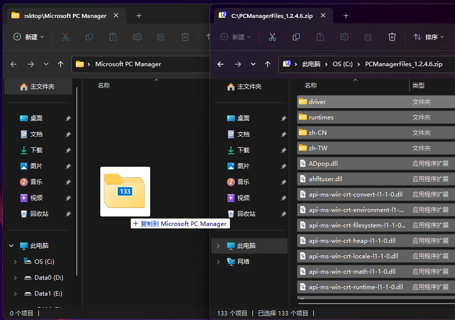
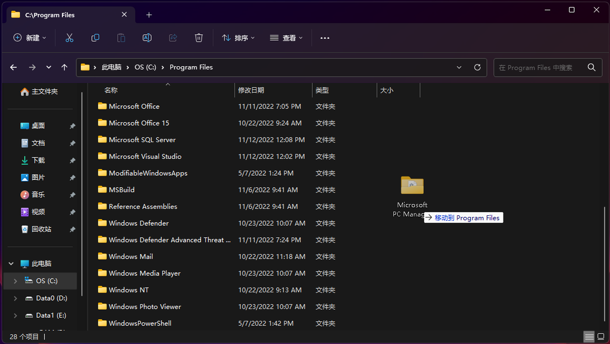
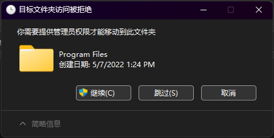
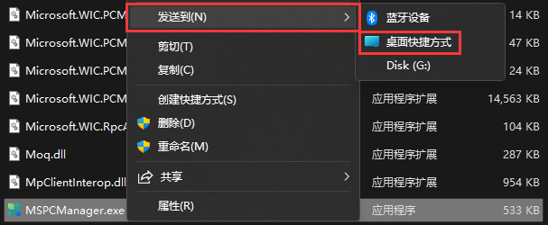

# 如何使用 .zip 形式的安装包
:::warning

为了确保微软电脑管家主程序及其组件的稳定性，在解压使用免安装版时，请选择解压到C:\Program Files\Microsoft PC Manager 文件夹；否则，因为解压到其它文件夹所引起的问题将不会受到支持与帮助。

:::
1. 在桌面新建文件夹并命名为“Microsoft PC Manager”，把压缩文件内所有的文件都解压到新建的文件夹里。

2. 打开 C:\Program Files 目录，并将“Microsoft PC Manager”文件夹复制。

3. 在弹窗中点击“继续(C)”。

4. 在“Microsoft PC Manager”文件夹里找到名为“MSPCManager.exe”的文件，左键选择它，然后按下 Shift+F10（如果是 Windows 10 或经典右键菜单的 Windows 11 可直接右键），在弹出的菜单栏中选择“发送到(N)”>“桌面快捷方式”。

5. 然后将桌面上的快捷方式重命名（可不做），然后双击即可运行微软电脑管家

