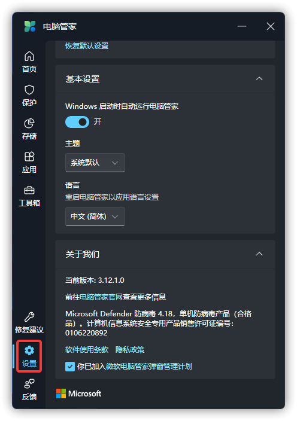

# 公开最新版本号及查询方式

## 公开最新版本号
最新版本号以 Microsoft Store 版本为准。

正式版：2024 年 7 月 1 日更新，版本号为 3.12.1.0

快速预览版：2024 年 7 月 1 日更新，版本号为 3.12.1.0

预览体验成员版：2024 年 4 月 30 日更新，版本号为 3.9.3.0

当版本号相同时，多个版本内容相同。

微软电脑管家公测版即将结束支持，请在 [Microsoft Store](https://www.microsoft.com/store/productid/9PM860492SZD) 或 WinGet 下载最新版。
如果你的设备没有 Microsoft Store 或 WinGet，可以从 [OneDrive](https://gbcs6-my.sharepoint.com/:f:/g/personal/gucats_gbcs6_onmicrosoft_com/EoscJOQ9taJFtx9LZLPiBM0BEmVm7wsLuJOuHnwmo9EQ5w?e=QWoXaL) 或群文件中获取微软电脑管家最新正式版。

## 版本号查询方式
点击微软电脑管家左下方的“设置”按钮。（图例版本不一定为最新）

