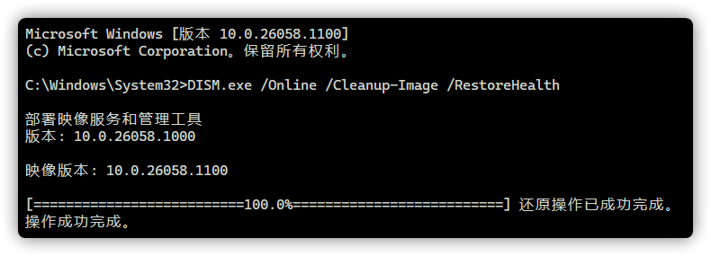

# 使用 DISM & SFC 命令功能修复损坏的系统映像
**特别提示：该功能并不能 100% 修复所有损坏的映像，必要时请参阅[《如何使用镜像对 Windows 进行修复》](#镜像修复)**

按下Windows 徽标键+X，并选择“PowerShell(管理员)”或“终端(管理员)”。

## 检查系统文件是否损坏并修复
扫描映像以检查是否损坏，命令操作可能需要几分钟才能完成。

```PowerShell
DISM.exe /Online /Cleanup-Image /ScanHealth
```


检查映像以查看是否检测到任何损坏，命令操作可能需要几分钟才能完成。

```PowerShell
DISM.exe /Online /Cleanup-Image /CheckHealth
```


<details>

<summary>关于映像检查</summary>
当您使用 /CheckHealth 参数时，DISM 工具将报告映像是否正常、可修复或不可修复。

如果映像不可修复，在尝试使用 [《Media Creation Tool 修复升级》](#media-creation-tool-修复升级)失败后，应当使用由 Microsoft 提供的系统镜像执行 **重新安装**。

如果映像是可修复的，您可以遵循下一步，使用 /RestoreHealth 参数来修复映像。（本章不对使用指定的映像源进行详解，有需要请参阅 [Microsoft Learn](https://learn.microsoft.com/troubleshoot/windows-server/deployment/fix-windows-update-errors)）

</details>

修复损坏的映像，命令操作可能需要几分钟才能完成。

```PowerShell
DISM.exe /Online /Cleanup-Image /RestoreHealth
```



使用 SFC 扫描并修复 Windows 资源，命令操作可能需要几分钟才能完成。

```PowerShell
SFC /SCANNOW
```


完成并重启后，部分由系统损坏带来的问题将被修复。如有需要，您可再次执行 Windows 更新。

## 如果遇到其它错误
如下图所示，在检查映像/修复损坏的映像时遇到“错误：<错误代码>”的提示，且 自行解决无果，您则需要请参阅[《如何使用镜像对 Windows 进行修复》](#镜像修复)进行系统修复。


# 使用镜像对 Windows 进行修复
[Windows 10](https://www.microsoft.com/software-download/windows10ISO) | [Windows 11](https://www.microsoft.com/software-download/windows11) | [Windows Insider](https://www.microsoft.com/en-us/software-download/windowsinsiderpreviewiso)

<details>

<summary>关于 Windows 10 镜像下载</summary>

:::warning 提示
Windows 10 不再在电脑端网页单独提供 ISO 下载，如果有需要，请在下载页面上按下 F12，再按下 Ctrl+Shift+M，然后按下 F5 刷新页面，最后按下 F12 即可。
:::


</details>

以下方式二选一即可。

## Media Creation Tool 修复升级
下载 Media Creation Tool：[Windows 10](https://go.microsoft.com/fwlink/?LinkId=691209) | [Windows 11](https://go.microsoft.com/fwlink/?linkid=2156295)

:::warning 注意
Windows 11 的 Media Creation Tool 仅能创建 ISO 镜像，而 Windows 10 可以直接使用 Media Creation Tool 升级/修复系统。
:::

1. 

2. 

<details>

<summary>若是 Windows 11 则会有以下选项</summary>

------
- a. 

- b. 

- c. 

创建完成后请参阅 [镜像修复](#镜像修复)
------

</details>

3. 

4. 

## 镜像修复
双击 .ISO 镜像文件使文件资源管理器自动挂载虚拟镜像，然后使用镜像根目录下的 Setup 应用程序对系统进行修复。（升级，所需时间≥30min）
1. 

2. 

3. 

4. 

5. 