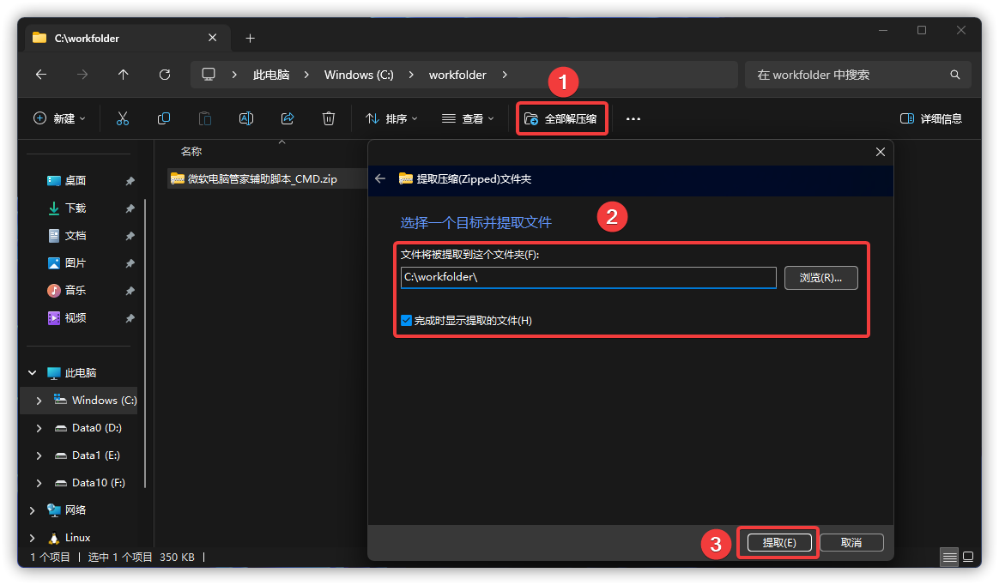
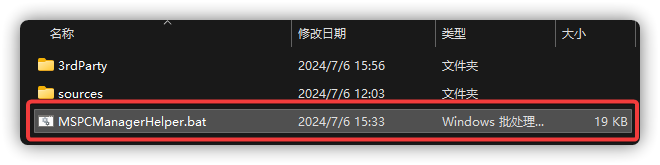
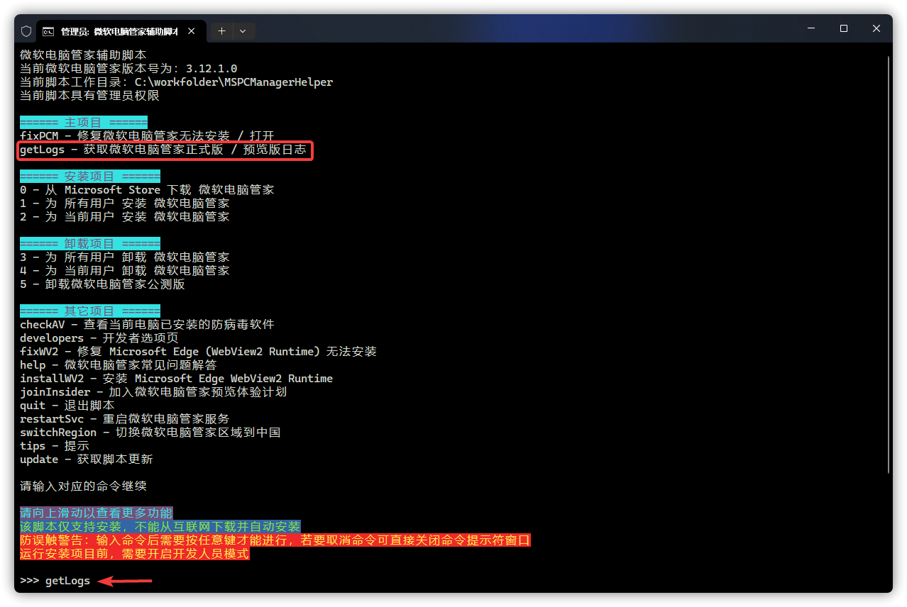
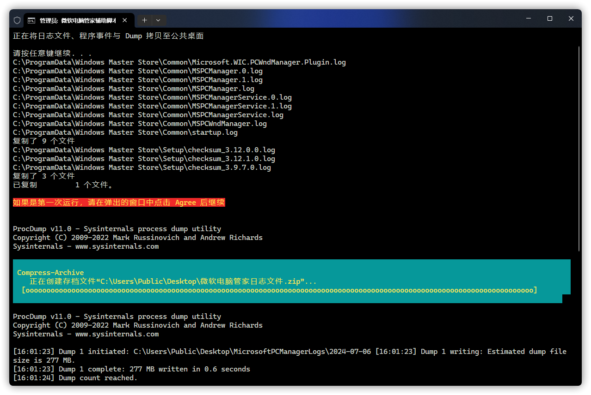
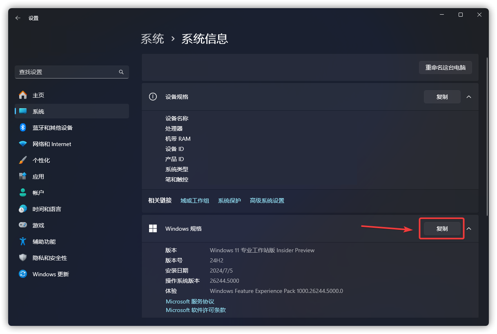
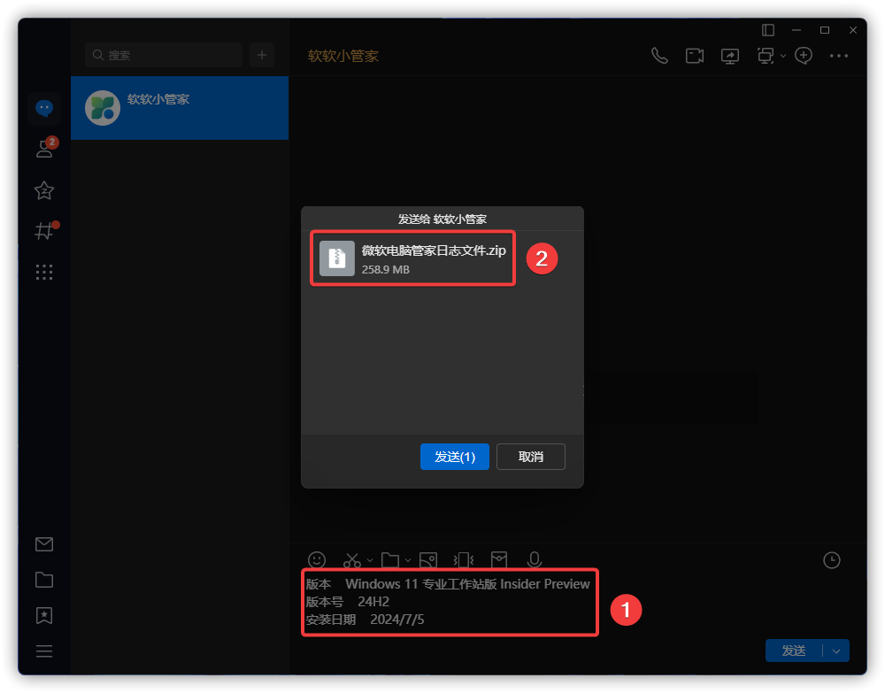

# 如何提交日志文件

从群文件、管理员或 [OneDrive](hhttps://gbcs6-my.sharepoint.com/:f:/g/personal/gucats_gbcs6_onmicrosoft_com/EtKwa-2la71HmG2RxkB5lngBvvRt9CFOYsyJG_HOwYIzNA) 获取 `微软电脑管家辅助脚本_CMD.zip`。

选择解压，并提取到当前文件夹目录下（无需再新建文件夹）。

完成后打开 MSPCManagerHelper 文件夹，双击 MSPCManagerHelper.bat 并打开。

打开后点根据提示，输入 `getLogs` 后按回车（不区分大小写）。

按任意键继续后，脚本会自动抓取日志、应用程序事件与微软电脑管家的 Dump 文件。

在打开的 Windows 设置里，点击“Windows 规格”旁边的复制。

随后，将桌面生成的`微软电脑管家日志文件.zip` 与复制的 Windows 规格发送给软软小管家，并附上你在使用微软电脑管家时遇到的问题，及微软电脑管家版本。

:::warning 警告
请不要把你获取到的 `MicrosoftPCManagerLogsFile.zip`、`MicrosoftPCManagerLogs 文件夹`及里面的任意文件发给任何你不信赖的人
:::

