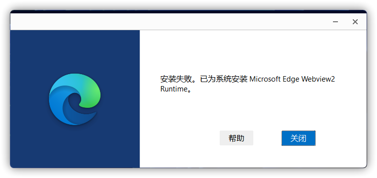

# Microsoft Edge WebView2 问题

## Microsoft Edge WebView 2 Runtime 安装程序无法打开
问题引起：映像劫持引起的安装程序错误重定向。

解决方案：

1. 从 [OneDrive](https://gbcs6-my.sharepoint.com/:u:/g/personal/gucats_gbcs6_onmicrosoft_com/ESvGdSUKfTtIrKfkEmlC3AABkDVyQwf3nWYcbc5tC1NiUg?e=rkTobg) 下载 `MicrosoftEdgeSetupUnlocker.reg` 并导入到注册表。或者自行创建 txt 文档，输入以下内容并保存后将后缀格式改为 `.reg` 再导入。

```Registry
Windows Registry Editor Version 5.00

[-HKEY_LOCAL_MACHINE\SOFTWARE\Microsoft\Windows NT\CurrentVersion\Image File Execution Options\MicrosoftEdgeUpdate.exe]

[HKEY_LOCAL_MACHINE\SOFTWARE\Microsoft\Windows NT\CurrentVersion\Image File Execution Options\MicrosoftEdgeUpdate.exe]
"DisableExceptionChainValidation"=dword:00000000
```

2. 重启计算机并尝试重新运行 Microsoft Edge WebView 2 Runtime 安装程序。

## 已为系统安装 Microsoft Edge Webview2 Runtime
问题图例：



解决方案：右键选择 Microsoft Edge WebView2 Runtime 安装程序，选择`以管理员身份运行`。