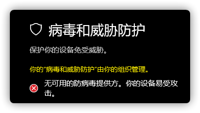
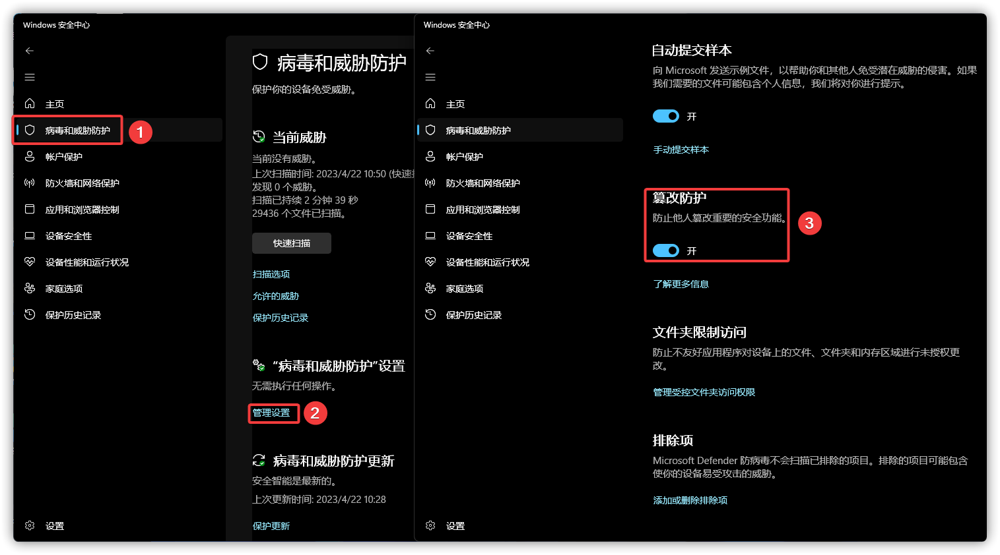
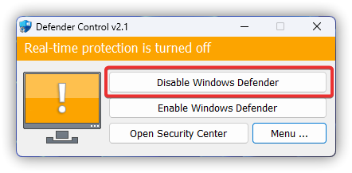
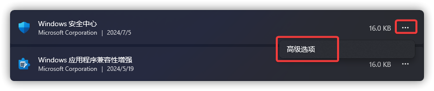
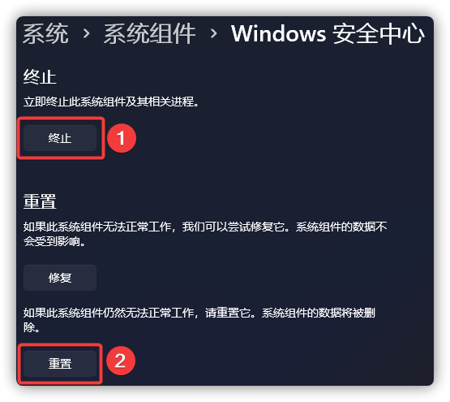
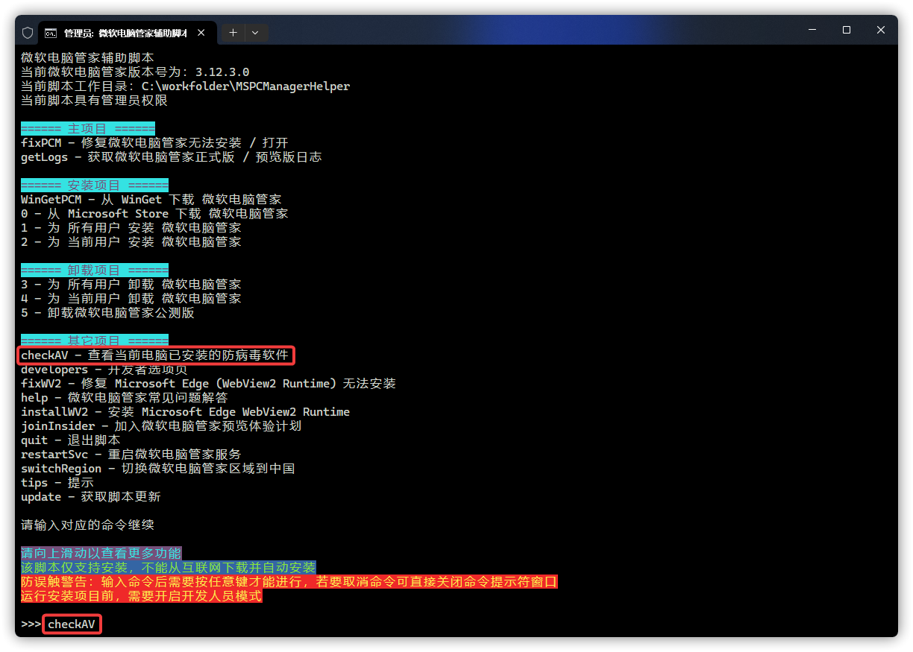
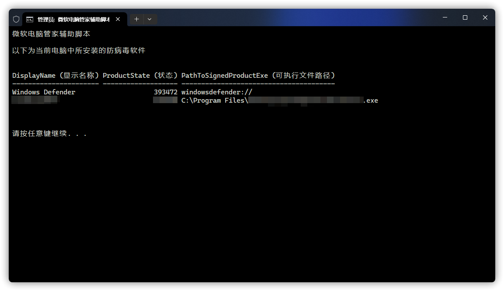

# Microsoft Defender 防病毒问题
<font size=1>Microsoft Defender 防病毒，早期被称为 Windows Defender (Antivirus)、Windows 安全中心、Microsoft AntiSpyware 等。</font>

## Windows 安全中心显示为空白
问题图例：


问题引起：可能被注册表屏蔽，或者 Microsoft Defender 防病毒组件被移除。

解决方案：先尝试从 [OneDrive](https://gbcs6-my.sharepoint.com/:u:/g/personal/gucats_gbcs6_onmicrosoft_com/ES5ZszNQoXtOiueo9CpywpEB4rn3BmazwAUR41snZLcEaw?e=xvUewk) 下载 `EnableMicrosoftDefender.reg`，打开后选择导入。若问题变成[《无可用的防病毒提供方》](#无可用的防病毒提供方)章节的内容，则请参阅[《你正在使用其他防病毒提供程序》](#你正在使用其他防病毒提供程序)章节。

**特别提示：若是你当前计算机使用的是神州网信政府版（EnterpriseG），该版本不内置 Microsoft Defender 防病毒，故无法使用此文章内任何方法来修复并使用该功能。**

## 无可用的防病毒提供方
问题图例：



问题引起 & 解决方案：请参阅[《没有活动的杀毒软件，电脑存在风险》](#没有活动的杀毒软件-电脑存在风险)章节。

## 没有活动的杀毒软件，电脑存在风险
问题图例：


问题引起：微软电脑管家正常运行需要 Microsoft Defender 防病毒及其组件，你的系统缺失该关键组件。

**特别提示：若是你当前计算机使用的是神州网信政府版（EnterpriseG），该版本不内置 Microsoft Defender 防病毒，故无法使用此文章内任何方法来修复并使用该功能。**

解决方案：（如果`开始菜单`中没有 `Windows 安全中心`，或无法正常使用 / 闪退的请看 2.，如果依旧不行请看 3.）

1. 自行搜索“防病毒软件 + 如何开启 Defender 防护”。

特别提示：Microsoft Defender 防病毒亦可能被其它等非防病毒软件所关闭。

2. 请参阅[《你正在使用其他防病毒提供程序》](#你正在使用其他防病毒提供程序)。

3. 请参阅[《如何使用镜像对 Windows 进行修复》](../appendix/repair-system-image#镜像修复)。

## 你正在使用其他防病毒提供程序
问题图例：


问题描述：未安装除微软电脑管家以外的防病毒提供程序，且无法打开实时防护。

解决方案：

1. 从这里下载 [dControl](https://www.sordum.org/files/downloads.php?st-defender-control)。

:::warning 注意
这是一个非 Microsoft 官方网站。此网站似乎提供了详细的步伐与安全的信息。网站可能会宣传您不需要的产品，在决定下载并安装之前，请彻底研究网站上的细节。
:::

2. 下载完成后打开压缩文件，打开里面的 `dControl.zip` 并解压到任意文件夹。（压缩包密码：sordum）


然后运行里面的 `dControl.exe`


3. 在`病毒和威胁防护` - `“病毒和威胁防护”设置` 的 `管理设置`中关闭`篡改防护`。



4. 在 dControl 中选择 `Disable Windows Defender`。



5. 再选择 `Enable Windows Defender`。


6. 最后选择 `Open Security Center`，再打开`篡改防护`即可。


若不成功请重复步骤 4 - 5，然后再自行开启实时防护。

7. 按下 WIN + R，输入 [ms-settings:systemcomponents](ms-settings:systemcomponents) 并回车。（如果未生效，请输入 [ms-settings:appsfeatures](ms-settings:appsfeatures)）

8. 找到名为 `Windows 安全中心`的程序，并点击旁边的 `...`，再点击`高级选项`。



9. 先点击`终止`，再点击`重置`，最后重启计算机。



以下是手动触发 [Microsoft Defender 防病毒更新](https://go.microsoft.com/fwlink/?LinkID=121721&arch=x64)，为选做内容。

10. 按下 WIN + Q 打开搜索，并输入 `cmd`，右键选择`以管理员身份运行`。


11. 在 CMD 中输入以下命令并回车。

```CMD
cd %ProgramFiles%/Windows Defender
MpCmdRun.exe -removedefinitions -dynamicsignatures
MpCmdRun.exe -SignatureUpdate
```


若有红色矩形框的报错，请将草绿色矩形框中给出的路径里的日志文件上传到 [Microsoft Community](https://answers.microsoft.com/zh-hans/newthread) 以寻求帮助。


并在类型中选择如下：（版本取决于你当前的 Windows 版本）


## 杀毒软件正在保护您的电脑
问题图例：


问题描述：未安装除微软电脑管家以外的防病毒提供程序，或者曾经有意无意间安装过其它防病毒提供程序并已卸载。

问题引起：其它防病毒提供程序未完全卸载引起的报错。

解决方案：

1. 从 [OneDrive](https://gbcs6-my.sharepoint.com/:f:/g/personal/gucats_gbcs6_onmicrosoft_com/EtKwa-2la71HmG2RxkB5lngBvvRt9CFOYsyJG_HOwYIzNA?e=iDgaEm) 中下载`微软电脑管家辅助脚本_CMD`，将其所有内容解压后，并运行里面的 `MSPCManagerHelper.bat`，输入 `checkAV` 并回车。



2. 等待一会，脚本将列出计算机上已安装防病毒软件的名称、状态与可执行文件路径。（Windows Defender 即为 Microsoft Defender 防病毒）



3. 根据给出的路径，自行解决或寻求管理员帮助清除。