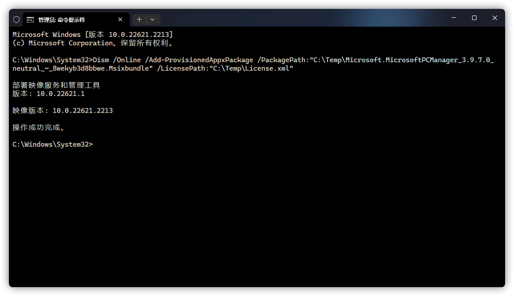

# 其它使用方法

## 为计算机上所有用户安装 / 卸载微软电脑管家

### 为计算机上所有用户安装微软电脑管家
1. 以管理员身份运行终端或 CMD。

2. 输入以下命令：

```CMD
Dism /Online /Add-ProvisionedAppxPackage /PackagePath:"<path\to\file>" /LicensePath:"<path\to\file>"
```

其中，`/PackagePath:"<path\to\file>"` 与 `/LicensePath:"<path\to\file>"` 中的 `<path\to\file>` 需要手动修改为微软电脑管家 .MSIX 安装包与 [License.xml](https://gbcs6-my.sharepoint.com/:u:/g/personal/gucats_gbcs6_onmicrosoft_com/EeoC00Vg3qVAhtN8BnKKU8cBd1cNJ4kpoagohN0D__Fk0w) 的路径。
例如：（若使用 `/Image` 参数，或安装后可以联网则不需要许可证文件，将 `/LicensePath:"<path\to\file>"` 修改为 `/SkipLicense` 即可）

```CMD
Dism /Online /Add-ProvisionedAppxPackage /PackagePath:"C:\Temp\Microsoft.MicrosoftPCManager_3.9.7.0_neutral_~_8wekyb3d8bbwe.Msixbundle" /LicensePath:"C:\Temp\License.xml"
```



### 为计算机上所有用户卸载微软电脑管家
1. 以管理员身份运行终端或 PowerShell。

2. 输入以下命令：

```PowerShell
Get-AppxPackage -AllUsers | where-object {$_.name -like "Microsoft.MicrosoftPCManager"} | Remove-AppxPackage -AllUsers
```